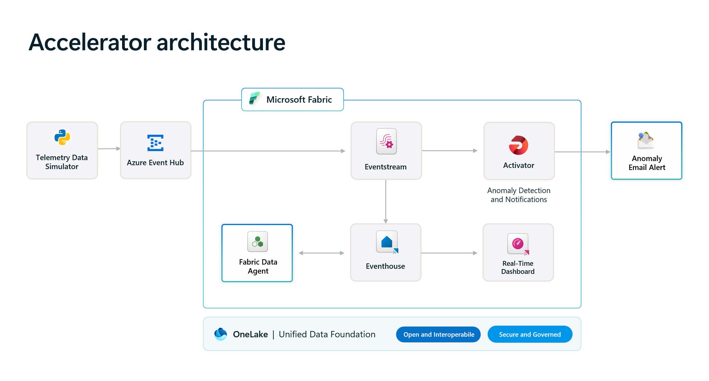
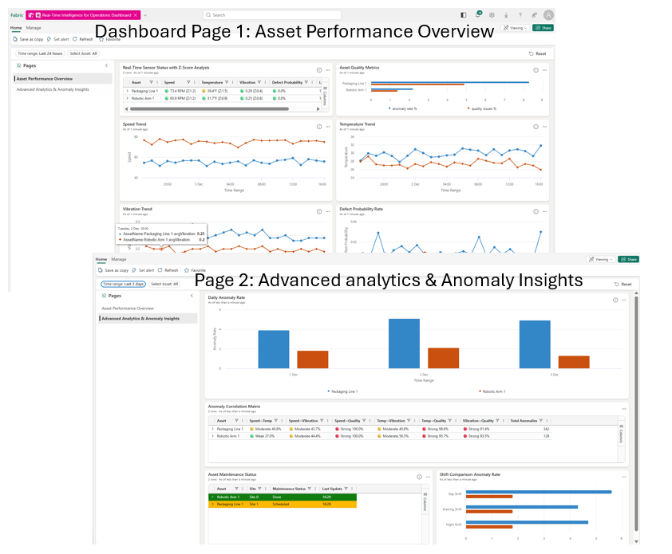

# Real-Time Intelligence for Operations Solution Accelerator

This solution accelerator provides the architecture and working solution for real-time intelligence for operations. We used simulated manufacturing facility asset data for the process flow. Historical and real-time performance measures such as speed, vibration, temperature, humidity, and defect probability are reported in a real-time intelligence dashboard. As real-time events are streamed in, anomalies are detected with notifications sent to a specified Outlook email account. The solution includes a customized Fabric Data Agent that provides a chat experience to answer users' questions with intelligence derived from the data. 

**Key use cases include:**

- Real-time dashboard with up to date analysis and reporting  
- Anomaly detection and notification 
- Customized data agent answering users' questions with intelligence derived from the data 

<br/>

<div align="center">
[**SOLUTION OVERVIEW**](#solution-overview) \| [**QUICK DEPLOY**](#quick-deploy) \| [**BUSINESS SCENARIO**](#business-use-case) \| [**SUPPORTING DOCUMENTATION**](#supporting-documentation)

</div>
<br/>

<h2>
Solution overview
</h2>
This solution accelerator provides a working solution for manufacturing asset performance monitoring, real-time anomaly detection, and anomaly notification. The manufacturing facility telemetry data is synthetically generated with the `Telemetry Data Simulator`. This architecture can be extended to other industries as long as the appropriate data is generated or actual operations data is ingested into the `Event Hub`, and related component configurations and Kusto Query Language (KQL) code are updated accordingly. For a brief description of the architecture, please refer to [Solution Architecture Overview](./docs/TechnicalArchitecture.md).

### Solution architecture

Below diagram illustrates the solution architecture.

|  |
| -------------------------------------------------------- |
|                                                          |

### How to customize
If you'd like to customize the solution accelerator, here are some common areas to start: 

- Data generation and collection: You can customize the data simulator to generate data that is closely aligned with your own industry or your own company. 
- Update the KQL queries for the tiles in Real-Time intelligence dashboard.  
- Update the Activator rules to meet your business needs
- Update the instructions to the Fabric Data Agent to align with your own business goals and data insights. 

<br/>

### Additional resources

[What's New in Microsoft Fabric](https://learn.microsoft.com/en-us/fabric/fundamentals/whats-new)

[Microsoft Fabric Blog](https://blog.fabric.microsoft.com/en-us/blog)

[What Is Real-Time Intelligence in Microsoft Fabric? ](https://learn.microsoft.com/en-us/fabric/real-time-intelligence/overview)

[Fabric data agent creation](https://learn.microsoft.com/en-us/fabric/data-science/concept-data-agent)

<br/>

### Key features
<details open>
  <summary>Click to learn more about the key features this solution enables</summary>


  - **Fabric Data Ingestion Program** <br/>The data ingestion program ingests data in a batch operation that can fill in 90 days of historical data, replace existing data, or generates historical data for specified period. For information on how to use it, please refer to [Fabric Data Ingestion Guide](./docs/FabricDataIngestion.md).

  - **Real Time Event Simulator** <br/>The real time event simulator is a practical data simulator that is used to simulate the manufacturing sensor data. It provides a data driver for the solution accelerator. For information how to use it, please refer to [Event Simulator Guide](./docs/EventSimulatorGuide.md).

  - **Real Time Intelligence Operations Dashboard** <br/>Real-Time Intelligence Operations Dashboard provides overview on how manufacturing assets are performing, and showing individual sensor data trends such as Speed, Vibration, Temperature, Humidity, and Defect Probability. It also shows daily anomaly rates for monitored assets. For details, please refer to [Real Time Intelligence Dashboard Guide](./docs/RealTimeIntelligenceDashboardGuide.md).

  - **Fabric Eventhouse with Customized Fabric Data Agent**

    Fabric evenhouse with an event database hosting simulated manufacturing telemetry data, stored in the `events` table, and related dimension tables such as `locations`, `sites`, `assets`, and `products`.  The deployment process creates 90 days of historical data with dates backtracked from the moment of deployment. After deployment, you can use the Fabric data Ingestion Program to refresh historic data, and the Real Time Event Simulator to send real time telemetry data to the deployed Event Hub, which sends to Fabric Event Stream which stores the real time telemetry data to the same `events` table. 

    A Fabric Data Agent can be created with the necessary configurations. Please refer to [Fabric Data Agent Guide](./docs/FabricDataAgentGuide.md) for details. Once created and configured, the Fabric Data Agent will be able to answer business questions by getting insights from the data stored in the EventHouse component. 

  - **Anomaly Detection and Alerts through Fabric Activator** <br/>Microsoft Activator is another key solution element that has configured anomaly detection rules. The rules are set to send outlook email notifications when an anomaly occurs with the detailed sensor data. It can also be easily configured to send the same information to a specified Teams channel. For more details, please refer to [Activator Guide](./docs/ActivatorGuide.md).

  - **Useful Data Analysis KQL Code** <br/>We used comprehensive data analysis KQL code to get insights from the data sets utilized. This provides a base to develop additional features for the solution. The code with documentation is provided to help users to get a quick start on data analysis. For more details please refer to [Data Analysis KQL Guide](./src/kql/data_analysis/data_analysis_guide.md). 

  - **Useful Performance Metrics KQL Code** <br/>A group of useful data analysis and performance metrics tracking KQL query sets are provided. These query sets can be used to develop additional dashboard tiles. For more information, please refer to [Performance Metrics KQL Queryset Guide](./src/kql/kql_queryset/kql_queryset_guide.md). 

  - **Demonstrator's Guide** <br/> After successful deployment of the solution accelerator, you or your colleague who has required access can demonstrate this solution by following the steps outlined in the [Demonstrator's Guide](./docs/DemonstratorGuide.md).

</details>


<br /><br />

<h2>
Quick deploy
</h2>

### How to install or deploy

Follow these steps to deploy the solution to your own Azure subscription:

| [](https://codespaces.new/microsoft/real-time-intelligence-operations-solution-accelerator) | [](https://vscode.dev/redirect?url=vscode://ms-vscode-remote.remote-containers/cloneInVolume?url=https://github.com/microsoft/real-time-intelligence-operations-solution-accelerator) | [&message=Open&color=blue&logo=visualstudiocode&logoColor=white)](https://vscode.dev/github/microsoft/real-time-intelligence-operations-solution-accelerator) |
|---|---|---|

<br/>

**One-command deployment** - Deploy everything with [Azure Developer CLI](https://learn.microsoft.com/azure/developer/azure-developer-cli/install-azd):

```bash
# Clone and navigate to repository
git clone https://github.com/microsoft/real-time-intelligence-operations-solution-accelerator.git
cd real-time-intelligence-operations-solution-accelerator

# Authenticate (required)
azd auth login
az login

# Recommended: set email to recieve alerts
azd env set FABRIC_ACTIVATOR_ALERTS_EMAIL "myteam@company.com"

# Optional: Customize resource names
azd env set FABRIC_WORKSPACE_NAME "My RTI Workspace"
azd env set FABRIC_EVENTHOUSE_NAME "my_custom_eventhouse"
azd env set FABRIC_EVENTHOUSE_DATABASE_NAME "my_custom_kql_db"
azd env set FABRIC_EVENT_HUB_CONNECTION_NAME "my_eventhub_connection"
azd env set FABRIC_RTIDASHBOARD_NAME "My Custom Dashboard"
azd env set FABRIC_EVENTSTREAM_NAME "my_custom_eventstream"
azd env set FABRIC_ACTIVATOR_NAME "my_custom_activator"

# Deploy everything
azd up
```
<br/>

Check more deployment aspects in our [deployment guide](./docs/DeploymentGuide.md):

| Topic | Description |
|---|---|
| [**Prerequisites**](./docs/DeploymentGuide.md#prerequisites) | Required Azure permissions, API access, and software installations (Python, Azure CLI, azd) |
| [**Event Simulation**](./docs/DeploymentGuide.md#start-event-simulation) | Once deployed, generate real-time telemetry data and test anomaly detection with the event simulator tool |
| [**Deployment validation**](./docs/DeploymentGuide.md#deployment-results) | Once deployed, verify Azure infrastructure, Fabric workspace components, and real-time data flow |
| [**Deployment overview**](./docs/DeploymentGuide.md#deployment-overview) | Two-phase deployment process: Azure infrastructure provisioning and Fabric workspace setup |
| [**Advanced configuration**](./docs/DeploymentGuide.md#advanced-configuration-options) | Customize workspace names, component names, email alerts, and capacity deployment options |
| [**Alternative deployment options**](./docs/DeploymentGuide.md#deployment-options) | Deploy locally, Azure Cloud Shell, GitHub Codespaces, or VS Code Dev Container |
| [**Limitations**](./docs/DeploymentGuide.md#known-limitations) | See identified limitations of the solution |
| [**Cleanup**](./docs/DeploymentGuide.md#environment-cleanup) | Remove all deployed resources and clean up your environment with `azd down` |

### Prerequisites and costs
Microsoft Fabric Capacity is enabled for your organization. Please refer to [Enable Microsoft Fabric for your organization](https://learn.microsoft.com/en-us/fabric/admin/fabric-switch) for more information. 

To deploy this solution accelerator, ensure you have access to an [Azure subscription](https://azure.microsoft.com/free/) with the necessary permissions to create **resource groups, resources, app registrations, and assign roles at the resource group level**. This should include Contributor role at the subscription level and Role Based Access Control role on the subscription and/or resource group level. Follow the steps in [Azure Account Set Up](./docs/AzureAccountSetUp.md).

Licensing and cost for establishing Fabric can be found at  [Microsoft Fabric concepts and licenses](https://learn.microsoft.com/en-us/fabric/enterprise/licenses#capacity) and [Microsoft Fabric Pricing](https://azure.microsoft.com/en-us/pricing/details/microsoft-fabric/).

Consumption model and pricing information for Azure Databricks can be found at [Serverless DBU consumption by SKU - Azure Databricks](https://learn.microsoft.com/en-us/azure/databricks/resources/pricing).

_Note: This is not meant to outline all costs as selected SKUs, scaled use, customizations, and integrations into your own tenant can affect the total consumption of this sample solution. The sample pricing sheet is meant to give you a starting point to customize the estimate for your specific needs._

<br/>

| Product | Description | Cost |
|---|---|---|
| [Microsoft Fabric](https://learn.microsoft.com/en-us/fabric) | Core Medallion Architecture in Microsoft Fabric, and Unified Data Platform for integration with other platforms such as Azure Databricks and Snowflakes. | [Pricing](https://learn.microsoft.com/en-us/fabric/enterprise/buy-subscription#prerequisites) |

<br/>

>⚠️ **Important:** To avoid unnecessary costs, remember to take down your app if it's no longer in use,
either by deleting the resource group in the Portal or running `azd down`.

<br /><br />

<h2>
Business use case
</h2>
Use cases can be summarized as below:

- For manufacturing plants, the plant manager or other business stakeholders can use the Fabric Data Agent to get business and operations intelligence quickly without the need to understand or create query code. For details, please refer to [Fabric Data Agent Guide](./docs/FabricDataAgentGuide.md) for details. 

- For manufacturing plants, the designated operations team receives email notification when anomaly occurs. The solution can also be configured to send anomaly notifications to a Teams Channel. Please refer to [Activator Guide](./docs/ActivatorGuide.md) for rules configuration options (Email or Teams).

- Plant manager uses real-time dashboard to analyze manufacturing plant asset performance, key telemetry data over time, with specified time periods such as last hour, last 12 hours, last 3 days, etc. 

  The image below shows the first page of the real-time intelligence operations dashboard, which displays sensor status, quality metrics, and individual sensor data trends. The second page shows additional information such as daily anomaly rate by asset, asset maintenance status, and fault correlations.  Please refer to [Real Time Intelligence Operations Dashboard Guide](./docs/RealTimeIntelligenceDashboardGuide.md) for more details. 

|  |
| ------------------------------------------------ |

<br/> 

⚠️ The sample data used in this repository is synthetic and generated using Python Programs. The data is intended for use as sample data only.

### Business value
<details>
  <summary>Click to learn more about what value this solution provides</summary>

  - **The solution provides multiple business functions with a simple architecture ** <br/>The deployed solution provides real time telemetry data monitoring, analysis, summarization, graphical reports, anomaly detection and notifications with a quick to deploy, secure, and simple architecture. 

  - **A Fabric Data Agent getting quick business intelligence without programming effort.  ** <br/>The Fabric Data Agent can be quickly configured with instructions delivered in this solution accelerator, providing quick and accurate insights from data effortlessly. No programming skills are necessary. 

  - **Real Time Intelligence for Operations Dashboard **<br/>

    The deployed solution accelerator provides a working architecture with best practices, security, components integration, and real-time intelligence for operations dashboard. 

  - **Configurable Activator providing anomaly detection and notifications** <br/>The deployed and configurable Activator provides real time anomaly detection and alert notifications out of the box. The rules are easily configurable. 

  - **Reusable and updatable real time event simulator and batch data update program** <br/>

    Real time telemetry data simulator and batch data ingestion / update program are provided to help to bring the solution to simulate a real time environment quickly. 

</details>

<br /><br />

<h2>
Supporting documentation
</h2>

### Security guidelines

This template uses Azure Key Vault to store all connections to communicate between resources.

This template also uses [Managed Identity](https://learn.microsoft.com/entra/identity/managed-identities-azure-resources/overview) for local development and deployment.

To ensure continued best practices in your own repository, we recommend that anyone creating solutions based on our templates ensure that the [GitHub secret scanning](https://docs.github.com/code-security/secret-scanning/about-secret-scanning) setting is enabled.

You may want to consider additional security measures, such as:

* Enabling Microsoft Defender for Cloud to [secure your Azure resources](https://learn.microsoft.com/en-us/azure/defender-for-cloud/).
* Protecting the Azure Container Apps instance with a [firewall](https://learn.microsoft.com/azure/container-apps/waf-app-gateway) and/or [Virtual Network](https://learn.microsoft.com/azure/container-apps/networking?tabs=workload-profiles-env%2Cazure-cli).

<br/>

### Frequently asked questions

[Click here](./docs/FAQs.md) to learn more about common questions about this solution.

<br/>

### Cross references
Check out similar solution accelerators

| Solution Accelerator | Description |
|---|---|
| [Unified Data Foundation with Microsoft Fabric](https://github.com/microsoft/unified-data-foundation-with-fabric-solution-accelerator) | Unified Data Foundation with Microsoft Fabric with Options to Integrate with Azure Databricks and Microsoft Purview. |
| [Agentic applications for unified data foundation](https://github.com/microsoft/agentic-applications-for-unified-data-foundation-solution-accelerator) | Agentic AI application that provides nature language query of the data using unified data foundation.  Description of solution accelerator. |

<br/>   


## Provide feedback  (To update the link)

Have questions, find a bug, or want to request a feature? [Submit a new issue](https://github.com/microsoft/real-time-intelligence-operations-solution-accelerator/issues) on this repo and we'll connect.

<br/>

## Responsible AI Transparency FAQ (To update the Transparency FAQs)
Please refer to [Transparency FAQ](./TRANSPARENCY_FAQ.md) for responsible AI transparency details of this solution accelerator.

<br/>

## Disclaimers

To the extent that the Software includes components or code used in or derived from Microsoft products or services, including without limitation Microsoft Azure Services (collectively, “Microsoft Products and Services”), you must also comply with the Product Terms applicable to such Microsoft Products and Services. You acknowledge and agree that the license governing the Software does not grant you a license or other right to use Microsoft Products and Services. Nothing in the license or this ReadMe file will serve to supersede, amend, terminate or modify any terms in the Product Terms for any Microsoft Products and Services. 

You must also comply with all domestic and international export laws and regulations that apply to the Software, which include restrictions on destinations, end users, and end use. For further information on export restrictions, visit https://aka.ms/exporting. 

You acknowledge that the Software and Microsoft Products and Services (1) are not designed, intended or made available as a medical device(s), and (2) are not designed or intended to be a substitute for professional medical advice, diagnosis, treatment, or judgment and should not be used to replace or as a substitute for professional medical advice, diagnosis, treatment, or judgment. Customer is solely responsible for displaying and/or obtaining appropriate consents, warnings, disclaimers, and acknowledgements to end users of Customer’s implementation of the Online Services. 

You acknowledge the Software is not subject to SOC 1 and SOC 2 compliance audits. No Microsoft technology, nor any of its component technologies, including the Software, is intended or made available as a substitute for the professional advice, opinion, or judgement of a certified financial services professional. Do not use the Software to replace, substitute, or provide professional financial advice or judgment.  

BY ACCESSING OR USING THE SOFTWARE, YOU ACKNOWLEDGE THAT THE SOFTWARE IS NOT DESIGNED OR INTENDED TO SUPPORT ANY USE IN WHICH A SERVICE INTERRUPTION, DEFECT, ERROR, OR OTHER FAILURE OF THE SOFTWARE COULD RESULT IN THE DEATH OR SERIOUS BODILY INJURY OF ANY PERSON OR IN PHYSICAL OR ENVIRONMENTAL DAMAGE (COLLECTIVELY, “HIGH-RISK USE”), AND THAT YOU WILL ENSURE THAT, IN THE EVENT OF ANY INTERRUPTION, DEFECT, ERROR, OR OTHER FAILURE OF THE SOFTWARE, THE SAFETY OF PEOPLE, PROPERTY, AND THE ENVIRONMENT ARE NOT REDUCED BELOW A LEVEL THAT IS REASONABLY, APPROPRIATE, AND LEGAL, WHETHER IN GENERAL OR IN A SPECIFIC INDUSTRY. BY ACCESSING THE SOFTWARE, YOU FURTHER ACKNOWLEDGE THAT YOUR HIGH-RISK USE OF THE SOFTWARE IS AT YOUR OWN RISK.  
