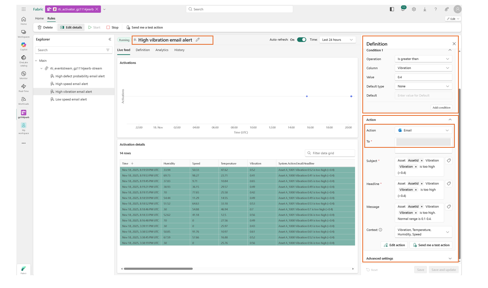
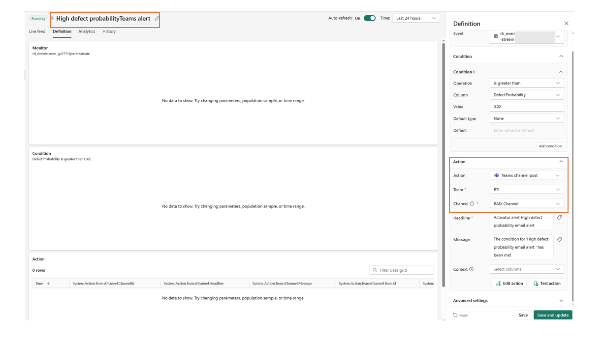

# Activator Anomaly Rules and Operations Guide

Please follow [Activator Rules Setup Guide](https://learn.microsoft.com/en-us/fabric/real-time-intelligence/data-activator/activator-tutorial) for details if you are new to Activator. 

## Overview 

After you complete the deployment of the solution accelerator, you will have an Activator created with pre-built rules that work with the sample data we provided. 

You can edit an existing rule, or create a new rule based on your business needs. The image below shows the areas where you can update the conditions and action for each rule. The areas enclosed with the red box are places you can make edits: 

- Alert Name
- Definition (Alert Conditions) 
- Action with Options 

After you are done with the updates, you can click `Save`, and then `Start` to activate the rule. Below diagram shows an rule definition and the action for high vibration. 

If any one of the rules were triggered by the set condition, for example, the rule set for high vibration, an email alert ill be sent to the specified account, as illustrated below.

## Option to send Microsoft Teams Alert

Please note the activator deployed has action type set to Outlook email. You can update it to send alert notifications to Microsoft Teams. You will need to configure it to point to the specific Teams and specific channel as desired. If you do not have an existing Teams channel set up, you will need to create one. After your Teams and Channel have been set up, you can update the rule Action to Teams channel post, as illustrated in below diagram

## Anomaly Event Alerts

 If the simulator is in normal mode, you will rarely receive anomaly events as things should be running much smoother during normal mode. When an anomaly is detected, the Activator will send alert notifications to specified emails, as illustrated in below email inbox.

When you open one of the emails, you will see something similar to below:

## Activator Rules Configuration Guide 

Each Activator rule is set up based on your defined telemetry data thresholds. For this solution accelerator, we used [data analysis KQL Queries](../src/kql/data_analysis) which produces [experimental results](../src/kql/data_analysis/data_analysis_sample_results.md) to help us to determine the thresholds for anomaly detection rules. 

- **Speed** - "MinSpeed": 7.52, "MaxSpeed": 129.86, "LowerThreshold_ZScore2": 28.22, "UpperThreshold_ZScore2": 101.96,
- **Vibration** - MinVibration": 0, "MaxVibration": 0.52, "PracticalLowerThreshold": 0.06, "UpperThreshold_ZScore2": 0.391,
- **Temperature**: "MinTemperature": 15.5, "MaxTemperature": 44.5, "LowerThreshold_ZScore2": 17.7, "UpperThreshold_ZScore2": 39.8
- **Humidity** - "MinHumidity": 30, "MaxHumidity": 70, "MinValue_ZScore": -1.7, "MaxValue_ZScore": 1.7
- **Defect Probability** - "MinDefectProbability": 0, "MaxDefectProbability": 0.7,"P5DefectProbability": 0, "P99DefectProbability": 0.31

You can set up a rule if any of the measured telemetry is below or above the range. These rules need to be defined based on your business needs. 

We have decided to implement below Activator rules: 

1. Speed too high: Speed > 100, expected range is [28, 100]
2. Speed too low: Speed < 28, expected range is [28, 100]
3. Vibration too high: Vibration > 0.4
5. Defect Probability too high: Defect Probability > 0.02

