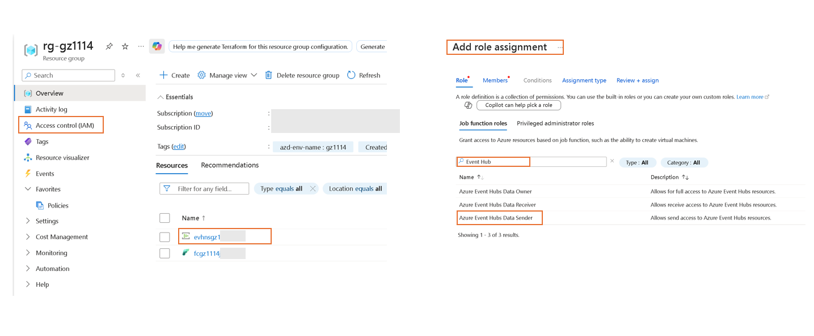
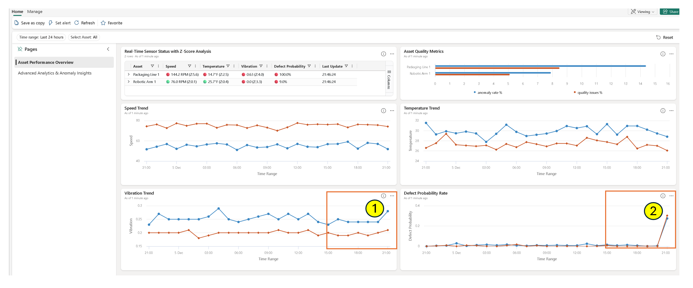
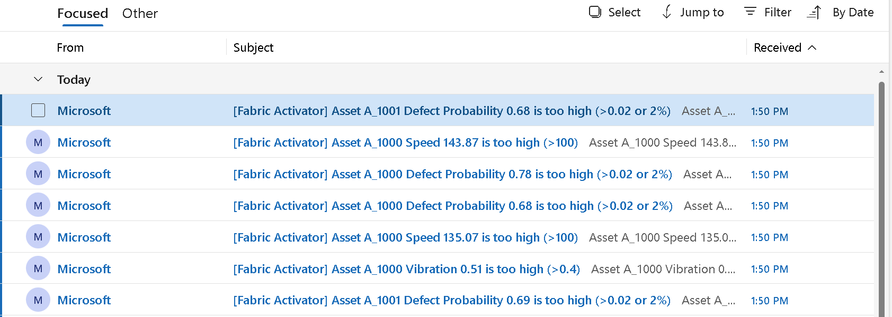
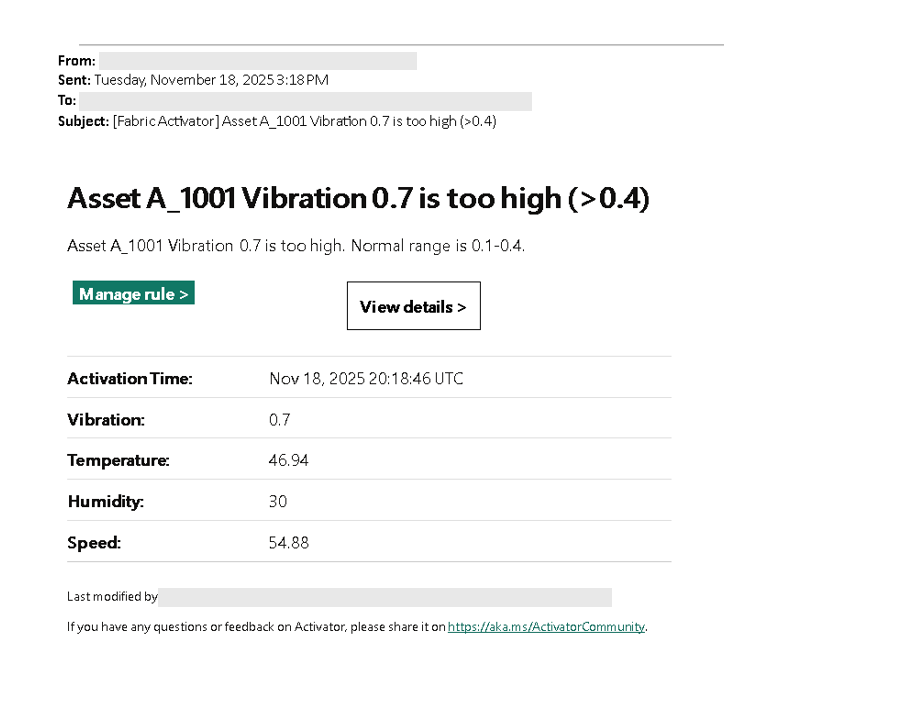
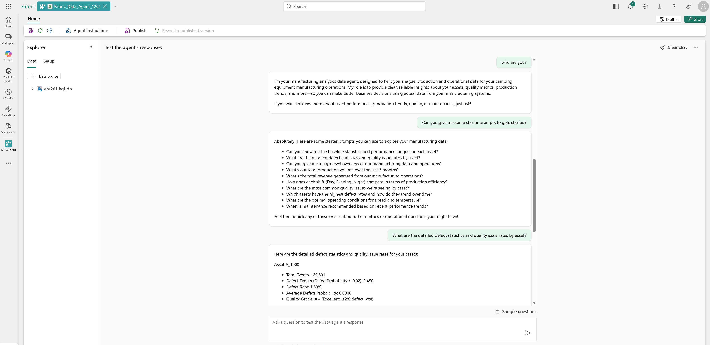

# Demonstrator's Guide 

This page provides guidance on how to set up a demonstration environment for the solution and how to start the data generation simulators. It also describes the security setup for the person to demonstrate the solution.

Please review the Access Requirements Section to ensure you have proper access first. 

## Access Requirements 

If you deployed the solution accelerator via AZD following the [Deployment Guide](./DeploymentGuide.md), you have already established the required access to the solution, and **you can skip this Access Requirements section**, and start at [Step 1. Refresh Historical Data](#step-1-refresh-historical-data).

If you are using a demonstration environment already set up by someone else, you will need below accesses: 

1. You will need to be added as a contributor of the Fabric workspace. If you are a viewer, you will not be able to update any resources such as [Real-Time Intelligence Operations Dashboard](./RealTimeIntelligenceDashboardGuide.md) or [Activator](./ActivatorGuide.md). Recommend role: **contributor**. 
2. You will need to be able to send simulated events to the Azure Event Hub deployed with the solution. The owner of the Event Hub or your Azure Admin can add you to the role of **Azure Event Hubs Data Sender**. Below diagram illustrates the key steps. 

## Step 1. Refresh Historical Data 

When the solution accelerator was deployed, it automatically creates 90 days of telemetry data and stores the data in the EventHouse database. By the time you demonstrate this solution, the data needs to be refreshed. You will need to follow instructions in [Fabric Data Ingestion Guide](./FabricDataIngestion.md) and use the options `--refresh-dates` and `--overwrite` to get a fresh and up to date dataset. 

## Step 2. Start Real Time Event Simulator 

You will need to start the Real-Time Event Simulator by following the instructions in [Event Simulator Guide](./EventSimulatorGuide.md) to start the simulator. We recommend you start with normal mode and then switch to anomaly mode to illustrate how anomaly events can be observed and how the anomaly events can trigger alerts.

## Step 3. Demonstrate the Real-Time Intelligence Operations Dashboard 

Please follow the [Real-Time Intelligence Operations Dashboard Guide](./RealTimeIntelligenceDashboardGuide.md) to understand the concepts and business metrics. You will want to highlight the anomaly spikes as shown in below diagram. Suggest you select time range filter as last 2 days or last 24 hours depending on when you started the anomaly event simulation. 

## Step 4. Demonstrate the Activator Anomaly Alerts 

Please follow the [Activator Guide](./ActivatorGuide.md) to understand how the anomaly detection rules are set. You may need to reconfigure the rules to send alerts to an email account that you have access to. You can also reconfigure the rules to send anomaly alerts to a Microsoft Teams channel instead of an email account. 

 If the simulator is in normal mode, you will rarely receive anomaly events as things should be running much smoother during normal mode. If the simulator is switched to 'anomaly' mode, you will get many alerts. The frequency of the simulated events can be adjusted with the simulator's command line options. This is well documented in the [Event Simulator Guide](./EventSimulatorGuide.md). You can stop and restart this event simulator at any time, or switch the operating mode while it is running. 

When you open one of the emails, you will see something similar to below:

## Step 5. Demonstrate the Fabric Data Agent

Please follow the [Fabric Data Agent Guide](./FabricDataAgentGuide.md) to understand how the Fabric Data Agent is created and set up. If it is not already set up, you can follow the instructions to create and configure a new Fabric Data Agent in minutes. After that, you can ask any questions you'd like the agent to answer. For starters, you can use the [sample test questions](./fabric_data_agent/user_sample_test_questions.md). 

In the Fabric workspace, find the Fabric Data Agent that is already set up. You will be able to chat with the agent right away. Below is the user interface you can expect: 

