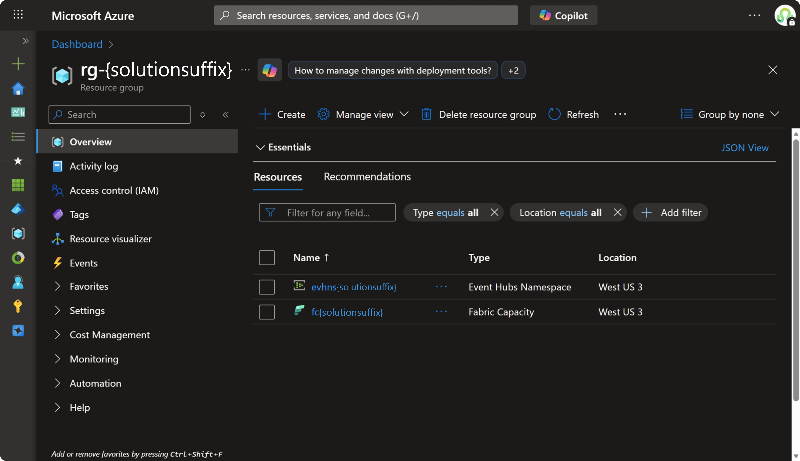
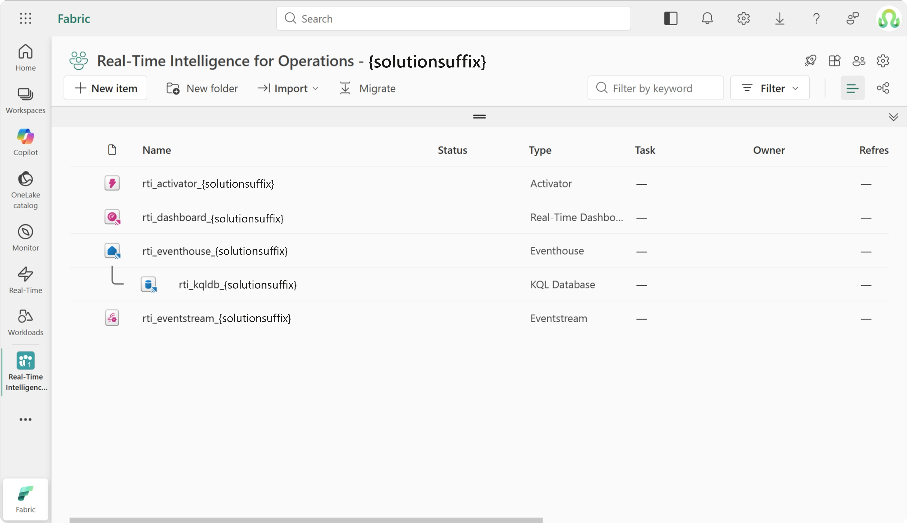
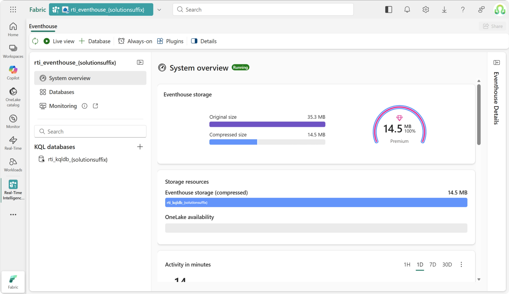
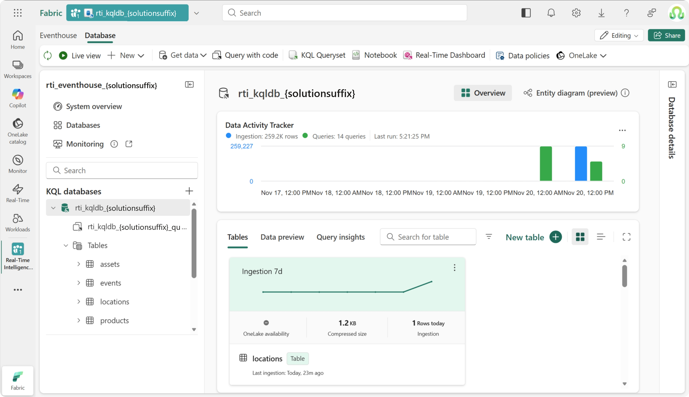
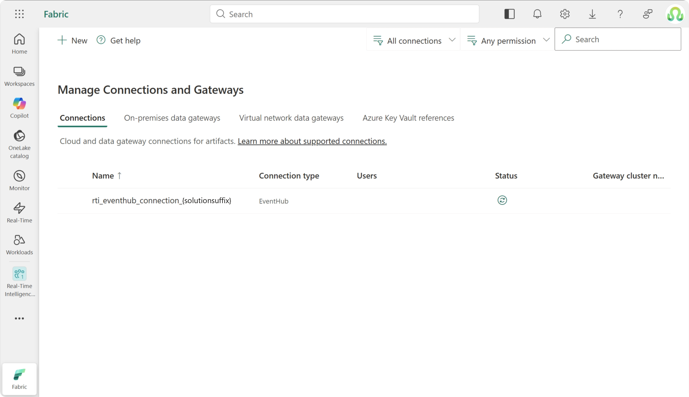
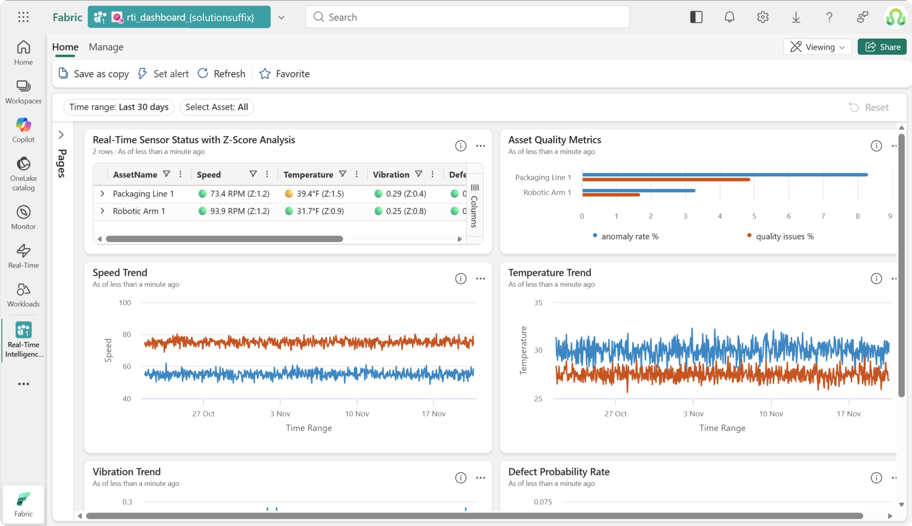
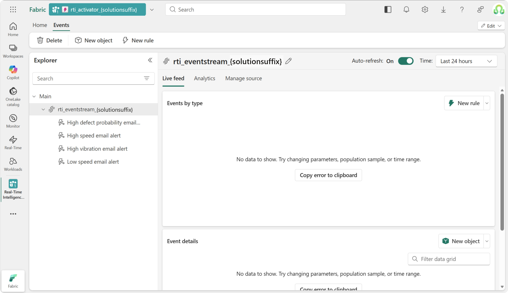
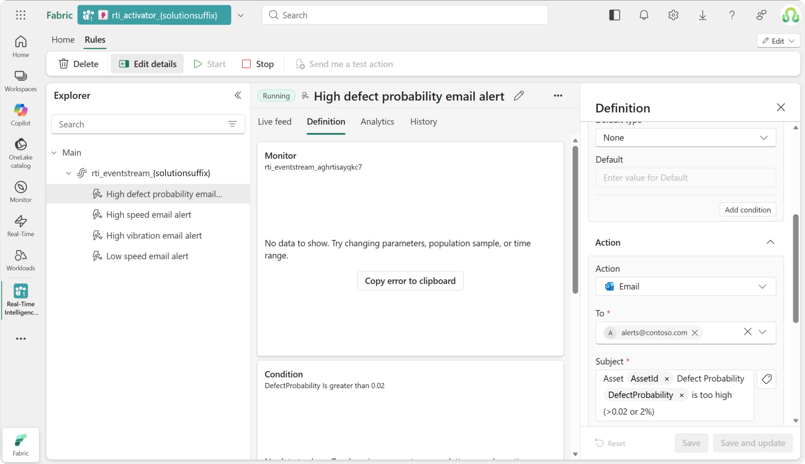
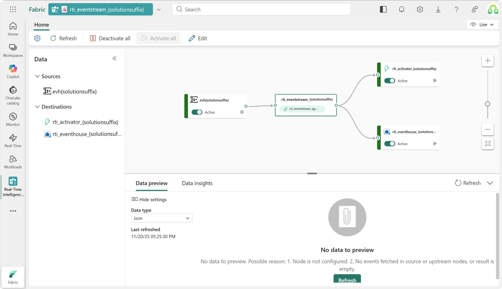

# Deployment Guide for Real-Time Intelligence (RTI) Operations 

Deploy the **Real-Time Intelligence Data Platform** solution accelerator using Azure Developer CLI - get a complete real-time analytics platform with Event Hub, Fabric Eventhouse, and KQL dashboards in minutes.

## 🚀 Quick Start

**One-command deployment** - Deploy everything with Azure Developer CLI ([prerequisites required](#prerequisites)). See also other available [deployment options](#deployment-options):

```bash
# Clone and navigate to repository
git clone https://dev.azure.com/CSACTOSOL/DATA%20-%20ACCL%20-%20MAAG%20RTI/_git/data_maag_rti
cd data_maag_rti

# Authenticate (required)
azd auth login
az login

# Optional: Customize resource names
azd env set FABRIC_WORKSPACE_NAME "My RTI Workspace"
azd env set FABRIC_EVENTHOUSE_NAME "my_custom_eventhouse"
azd env set FABRIC_EVENTHOUSE_DATABASE_NAME "my_custom_kql_db"
azd env set FABRIC_EVENT_HUB_CONNECTION_NAME "my_eventhub_connection"
azd env set FABRIC_RTIDASHBOARD_NAME "My Custom Dashboard"
azd env set FABRIC_EVENTSTREAM_NAME "my_custom_eventstream"
azd env set FABRIC_ACTIVATOR_NAME "my_custom_activator"
azd env set FABRIC_ACTIVATOR_ALERTS_EMAIL "myteam@company.com"

# Deploy everything
azd up
```

During deployment, you'll specify:
- **Environment name** (e.g., "myrtisys"). This will be used to build the name of the deployed Azure resources.
- **Azure subscription**.
- **Azure resource group**.

**What you get**: Complete real-time analytics platform with Event Hub, Fabric Eventhouse, KQL database, sample data, streaming capabilities, and automated alerting with Activator.

### Next Steps
- **Check requirements first**: Review [Prerequisites](#prerequisites) for permissions and software needed
- **Simulate real time data**: Follow [Start event simulation](#start-event-simulation) steps to run the tool
- **See what's deployed**: Check [Deployment Results](#deployment-results) for detailed component overview and verification steps
- **Understand the deployment logic**: Review [Deployment Overview](#deployment-overview) for technical details
- **Check advanced customization**: Explore [Advanced Configuration Options](#advanced-configuration-options) for naming and settings
- **See all available deployment options**: See [Deployment Options](#deployment-options) (Cloud Shell, Codespaces, etc.)
- **Troubleshoot issues**: Review [Known Limitations](#known-limitations) for common problems and solutions
- **Remove environment**: Use [Environment Cleanup](#environment-cleanup) to completely remove your deployment

---

## Prerequisites

Before starting, ensure your deployment identity has the following requirements.

> **📋 Deployment Identity Types**
> 
> The deployment can be executed using different identity types:
> - **User Account**: Interactive deployment using your Azure AD credentials.
> - **Service Principal**: Application identity for automated/CI-CD scenarios.
> - **Managed Identity**: Azure-managed identity for secure automated deployments.
>
> For more details, see [Fabric Identity Support](https://learn.microsoft.com/rest/api/fabric/articles/identity-support)

### 🔐 Azure Permissions
- [ ] **Resource Group Access**: Ensure your deployment identity has permissions on target Resource Group to deploy Bicep templates and create Azure resources using appropriate [Azure RBAC built-in roles](https://learn.microsoft.com/azure/role-based-access-control/built-in-roles) (e.g. has [Contributor](https://learn.microsoft.com/azure/role-based-access-control/built-in-roles#contributor) or [Owner](https://learn.microsoft.com/azure/role-based-access-control/built-in-roles#owner))
- [ ] **`Microsoft.Fabric` Resource Provider Access**: Verify your Azure Subscription has [Microsoft.Fabric resource provider](https://learn.microsoft.com/azure/azure-resource-manager/management/azure-services-resource-providers) enabled
- [ ] **`Microsoft.EventHub` Resource Provider Access**: Verify your Azure Subscription has Event Hub resource provider enabled

### 🔗 API Permissions
- [ ] **Fabric REST API - Workspace Management**: Access to create and manage Fabric workspaces
- [ ] **Fabric REST API - Item Creation**: Access to create Eventhouses, KQL databases, and dashboards
- [ ] **Azure Event Hubs API**: Access to create and manage Event Hub resources

### 💻 Software Requirements
- [ ] **Python**: Install version 3.9+ as runtime environment for deployment scripts from [Download Python](https://www.python.org/downloads/)
- [ ] **Azure CLI**: Install latest version for Azure authentication and resource management from [Install Azure CLI](https://learn.microsoft.com/cli/azure/install-azure-cli)
- [ ] **Azure Developer CLI**: Install latest version for simplified deployment orchestration from [Install Azure Developer CLI](https://learn.microsoft.com/azure/developer/azure-developer-cli/install-azd)

---

## Start Event Simulation

Start a simulation of streaming events in real-time to the newly created environment:

- **Documentation**: Review the [Event Simulator Guide](EventSimulatorGuide.md) for detailed setup instructions
- **Quick Start**: Use the simulator to generate sample telemetry and event data
- **Anomaly Testing**: Trigger anomaly events to test real-time detection and automated alerting capabilities

---

## Deployment Overview

This solution accelerator uses a two-phase deployment approach that creates a complete real-time analytics platform with Event Hub streaming, Fabric Eventhouse, KQL dashboards, and automated alerting with Activator. The deployment is designed to be **idempotent** and **safe to re-run**, intelligently detecting existing resources and only creating what's missing.

The deployment executes in two coordinated phases using Azure Developer CLI orchestration:

**Phase 1: Infrastructure Provisioning** - Azure Developer CLI executes [`main.bicep`](../infra/main.bicep) with parameters from [`main.parameters.json`](../infra/main.parameters.json) to create Azure resources using [ARM idempotency](https://learn.microsoft.com/azure/azure-resource-manager/templates/deployment-tutorial-local-template?tabs=azure-powershell#deploy-template):
   - **Microsoft Fabric Capacity**: Dedicated compute resources with configured admin permissions (updates configuration if parameters change)
   - **Azure Event Hub**: Real-time event ingestion service with namespace and authorization rules
   - **Resource Group**: Container for all Azure resources with proper tagging

**Phase 2: Fabric Workspace Setup** - Azure Developer CLI runs [`Run-FabricRTIPythonScript.ps1`](../infra/scripts/utils/Run-FabricRTIPythonScript.ps1) orchestrator which manages Python environment setup and executes [`deploy_fabric_rti.py`](../infra/scripts/fabric/deploy_fabric_rti.py) to intelligently manage Fabric resources:
   - **Workspace**: Detects existing workspace by name or creates new one, assigns to specified capacity
   - **Eventhouse**: Creates real-time analytics database with KQL capabilities and auto-generated database
   - **KQL Database**: Sets up tables and schema for event data with proper indexing
   - **Sample Data**: Loads CSV files and generates manufacturing telemetry data for testing
   - **Event Hub Connection**: Establishes secure connection between Event Hub and Eventhouse using SAS tokens
   - **Real-Time Dashboard**: Creates KQL dashboard for monitoring and visualization
   - **Eventstream**: Sets up data flow pipeline connecting Event Hub to Eventhouse
   - **Activator**: Configures real-time alerting and notifications for anomaly detection
   - **Administrators**: Adds new workspace administrators without removing existing ones

The deployment orchestration coordinates both phases through Azure Developer CLI hooks, passing Bicep outputs as environment variables to the Python scripts, and ensuring proper sequencing with comprehensive error handling and rollback capabilities.

---

## Deployment Results

After successful deployment, you'll have a complete real-time operations platform set in Fabric and Azure, with all the elements listed below:

### Azure Infrastructure

| Resource | Purpose |
|----------|---------|
| **[Fabric Capacity](https://learn.microsoft.com/fabric/admin/capacity-settings?tabs=power-bi-premium)** | Dedicated compute for Fabric workloads |
| **[Azure Event Hub](https://learn.microsoft.com/azure/event-hubs/)** | Real-time event ingestion service |



### Fabric Components

#### Fabric Workspace

Workspace created with the specified or default name: `Real-Time Intelligence for Operations - <your azd env name><suffix>`. The workspace is automatically assigned to the specified Fabric capacity and configured with proper permissions.



#### Eventhouse and KQL Database

| Component | Purpose | Details |
|-----------|---------|---------|
| **Eventhouse** | Real-time analytics engine | Named `rti_eventhouse_<env-name><suffix>` with query service URI |
| **KQL Database** | High-performance analytics database | Named `rti_kqldb_<env-name><suffix>` with configured tables and schema |
| **Events Table** | Real-time event data storage | Primary table for streaming event ingestion with proper indexing |

**Eventhouse**


<br/>



#### Sample Data

The solution includes comprehensive sample data for real-time analytics scenarios:
- **Asset telemetry data**: Equipment sensors, performance metrics, and operational data
- **Event data**: Real-time operational events with timestamps and metadata
- **Location data**: Asset locations and geographical information
- **Historical data**: Pre-loaded datasets for testing and demonstration purposes

#### Event Hub Connection

| Component | Purpose | Details |
|-----------|---------|---------|
| **Connection** | Secure Event Hub to Eventhouse link | Named `rti_eventhub_connection_<env-name><suffix>` using SAS token authentication |



#### Real-Time Dashboard

| Component | Purpose | Details |
|-----------|---------|---------|
| **KQL Dashboard** | Real-time monitoring and visualization | Named `rti_dashboard_<env-name><suffix>` with pre-configured charts and metrics |
| **Data Source** | Connected to Eventhouse database | Automatically linked to KQL database for live data visualization |



#### Activator (Real-Time Alerts)

| Component | Purpose | Details |
|-----------|---------|---------|
| **Activator** | Real-time alerting and notifications | Named `rti_activator_<env-name><suffix>` for automated anomaly detection |
| **Event Source** | Eventstream data monitoring | Monitors data flow from EventStream source |
| **Alert Rules** | Automated notification triggers | Pre-configured rules: High Speed (>100), Low Speed (<28), High Vibration (>0.4), High Defect Probability (>0.02) |
| **Email Notifications** | Real-time alert delivery | Configured email alerts with detailed asset information and contextual data |

**Activator**



<br/>

**Rules**



#### Eventstream

| Component | Purpose | Details |
|-----------|---------|---------|
| **Eventstream** | Data flow orchestration | Named `rti_eventstream_<env-name><suffix>` connecting Event Hub to Eventhouse |
| **Source** | Event Hub input connector | EventStream source for real-time data ingestion from Azure Event Hub |
| **Destination** | Eventhouse output connector | Connected to Eventhouse for streaming data into KQL database |
| **Event Processing** | Real-time data processing | Processes telemetry data including AssetId, Speed, Vibration, Temperature, Humidity, and DefectProbability |



---

## Deployment Options

Choose your deployment environment based on your workflow and requirements. All options use the same [Deploy with AZD](#deploy-with-azd) commands with environment-specific setup.

| Environment | Best For | Setup Required | Notes |
|-------------|----------|----------------|-------|
| **[Local Machine](#local-machine)** | Full development control | Install [software requirements](#software-requirements) | Most flexible, requires local setup |
| **[Azure Cloud Shell](#azure-cloud-shell)** | Zero setup | Just a web browser | Pre-configured tools, session timeouts |
| **[GitHub Codespaces](#github-codespaces)** | Team consistency | GitHub account | Cloud development environment |
| **[Dev Container](#vs-code-dev-container)** | Standardized tooling | Docker Desktop + VS Code | Containerized consistency |

### Local Machine
Deploy with full control over your development environment.

**Setup requirements**: Install the [software requirements](#software-requirements)

**Deployment**: Use the standard [Deploy with AZD](#deploy-with-azd) commands

### Azure Cloud Shell
Deploy from Azure's browser-based terminal with zero local installation.

**Setup**: Open [Azure Cloud Shell](https://shell.azure.com) and install Azure Developer CLI:
```bash
curl -fsSL https://aka.ms/install-azd.sh | bash && exec bash
```

**Deployment**: Run the [Deploy with AZD](#deploy-with-azd) commands (Azure CLI pre-authenticated)

### GitHub Codespaces  
Deploy from a cloud development environment with pre-configured tools.

**Setup**: 
1. Go to the repository
2. Click **Code** → **Codespaces** → **Create codespace**

**Deployment**: Install azd and run deployment commands with device authentication:
```bash
# Install azd if needed
curl -fsSL https://aka.ms/install-azd.sh | bash && exec bash

# Use device code authentication  
azd auth login --use-device-code

# Continue with deployment commands
```

### VS Code Dev Container
Deploy from a containerized environment for team consistency.

**Setup**: 
1. Install [Docker Desktop](https://www.docker.com/products/docker-desktop) and [Dev Containers extension](https://marketplace.visualstudio.com/items?itemName=ms-vscode-remote.remote-containers)
2. Clone repository and open in VS Code
3. Reopen in container when prompted

**Deployment**: All tools pre-installed - run [Deploy with AZD](#deploy-with-azd) commands directly

---

## Advanced Configuration Options

The solution accelerator provides flexible configuration options to customize your deployment.

### 🏗️ Infrastructure Configuration

The solution accelerator provides flexible configuration options to customize your deployment. These environment variables can be set before running `azd up` to override default naming conventions.

#### Customizable Environment Variables

| Parameter | Environment Variable | Description | Default | Example |
|-----------|---------------------|-------------|---------|---------|
| **Workspace Name** | `FABRIC_WORKSPACE_NAME` | Custom name for the Fabric workspace | `Real-Time Intelligence for Operations - <env-name><suffix>` | `"My RTI Workspace"` |
| **Eventhouse Name** | `FABRIC_EVENTHOUSE_NAME` | Name for the Fabric Eventhouse | `rti_eventhouse_<env-name><suffix>` | `"my_custom_eventhouse"` |
| **KQL Database Name** | `FABRIC_EVENTHOUSE_DATABASE_NAME` | Name for the KQL database | `rti_kqldb_<env-name><suffix>` | `"my_custom_kql_db"` |
| **Event Hub Connection** | `FABRIC_EVENT_HUB_CONNECTION_NAME` | Name for Event Hub connection | `rti_eventhub_connection_<env-name><suffix>` | `"my_eventhub_connection"` |
| **Dashboard Title** | `FABRIC_RTIDASHBOARD_NAME` | Title for the real-time dashboard | `rti_dashboard_<env-name><suffix>` | `"My Custom Dashboard"` |
| **Eventstream Name** | `FABRIC_EVENTSTREAM_NAME` | Name for the Fabric Eventstream | `rti_eventstream_<env-name><suffix>` | `"my_custom_eventstream"` |
| **Activator Name** | `FABRIC_ACTIVATOR_NAME` | Name for the real-time alerting Activator | `rti_activator_<env-name><suffix>` | `"my_custom_activator"` |
| **Activator Alerts Email** | `FABRIC_ACTIVATOR_ALERTS_EMAIL` | Email address for Activator alert notifications | `alerts@contoso.com` | `"myteam@company.com"` |

#### Automatically Managed Environment Variables

These variables are automatically set by the deployment process (Bicep outputs) and typically don't need manual configuration:

| Environment Variable | Description | Source |
|---------------------|-------------|--------|
| `AZURE_ENV_NAME` | Environment name (used in resource naming) | Azure Developer CLI |
| `AZURE_SUBSCRIPTION_ID` | Azure subscription ID | Azure Developer CLI |
| `AZURE_RESOURCE_GROUP` | Azure resource group name | Azure Developer CLI |
| `AZURE_FABRIC_CAPACITY_NAME` | Name of the Fabric capacity | Bicep template output |
| `AZURE_EVENT_HUB_NAME` | Event Hub name | Bicep template output |
| `AZURE_EVENT_HUB_NAMESPACE_NAME` | Event Hub namespace name | Bicep template output |
| `SOLUTION_SUFFIX` | Suffix appended to resource names | Azure Developer CLI |

**Configuration Examples:**

```bash
# Set custom names
azd env set FABRIC_WORKSPACE_NAME "My RTI Workspace"
azd env set FABRIC_EVENTHOUSE_NAME "my_custom_eventhouse"
azd env set FABRIC_EVENTHOUSE_DATABASE_NAME "my_custom_kql_db"
azd env set FABRIC_EVENT_HUB_CONNECTION_NAME "my_eventhub_connection"
azd env set FABRIC_RTIDASHBOARD_NAME "My Custom Dashboard"
azd env set FABRIC_EVENTSTREAM_NAME "my_custom_eventstream"
azd env set FABRIC_ACTIVATOR_NAME "my_custom_activator"
azd env set FABRIC_ACTIVATOR_ALERTS_EMAIL "myteam@company.com"

# Use existing Fabric capacity (cost optimization)
azd env set 'AZURE_DEPLOY_FABRIC_CAPACITY' 'false'

# Deploy with custom configuration
azd up
```

> **💡 Cost Optimization Note**
>
> **For SAS and MSFT development environments**: To reduce cost footprint of Fabric Capacity, you can set `AZURE_DEPLOY_FABRIC_CAPACITY` to `false` to use a pre-defined capacity for testing instead of deploying a new capacity instance.

---

## Known Limitations

###  Fabric REST API Permission Issues

**Issue**: Service Principals may lack sufficient permissions to access Microsoft Fabric REST APIs.

**Impact**: 
- Deployment fails during workspace creation or management operations
- Clear error messages guide resolution

**Resolution**:
1. **Verify Fabric Licensing**: Ensure your organization has appropriate [Microsoft Fabric licenses](https://learn.microsoft.com/fabric/enterprise/licenses)
2. **Review Identity Configuration**: Follow the [Fabric Identity Support](https://learn.microsoft.com/rest/api/fabric/articles/identity-support) documentation
3. **Configure Service Principal**: If using a service principal, ensure it's properly configured
4. **Check API Permissions**: Verify the deployment identity has the required Fabric REST API permissions as listed in the [prerequisites](#prerequisites)

---

## Environment Cleanup

When you no longer need your deployed environment, Azure Developer CLI provides a streamlined approach to completely remove all resources and clean up your Microsoft Fabric workspace.

The `azd down` command orchestrates a complete environment cleanup process that:

1. **Removes Fabric Workspace**: Safely deletes the Microsoft Fabric workspace and all associated items
2. **Deprovisions Azure Resources**: Removes all Azure infrastructure components including Event Hub and Fabric Capacity
3. **Preserves Local Environment**: Keeps your local development environment and configurations intact

**Complete cleanup commands:**

```bash
# Navigate to your solution directory
cd data_maag_rti

# Remove everything deployed by azd up
azd down --force --purge
```