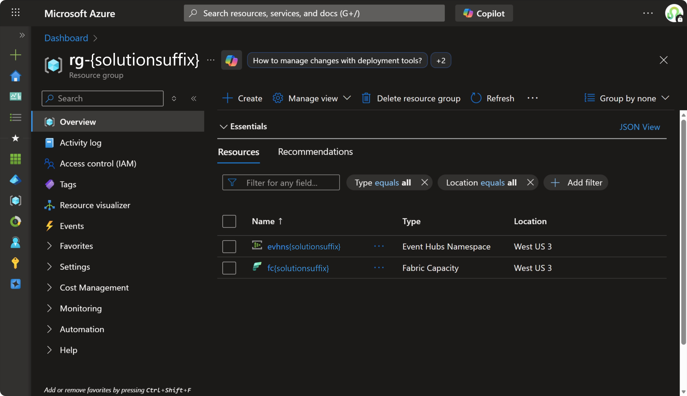
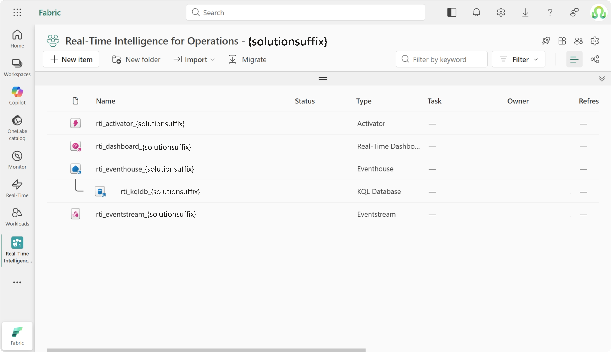
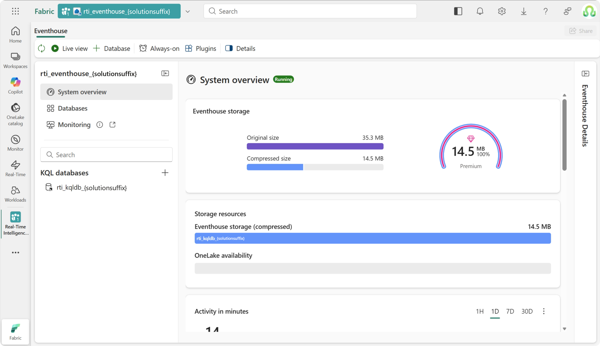
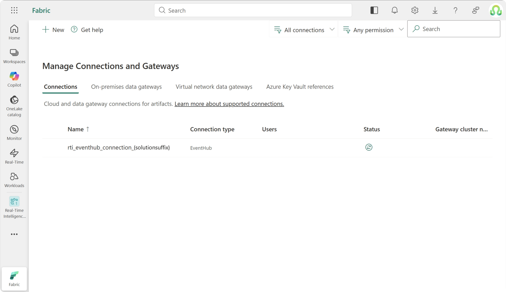
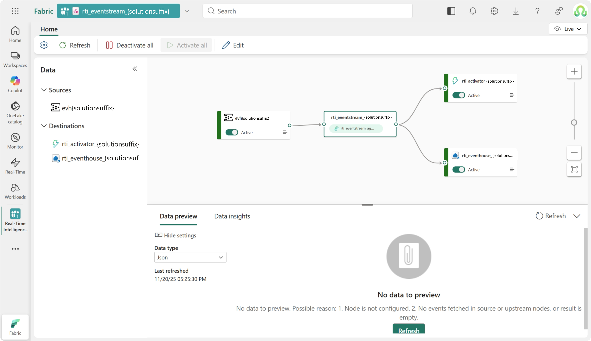

# Deployment Guide

Deploy the **Real-Time Intelligence for Operations Solution Accelerator** using Azure Developer CLI to provision a complete real-time analytics platform. This automated deployment creates Azure Event Hub for data ingestion, Microsoft Fabric Eventhouse with KQL database for analytics, interactive dashboards for monitoring, and automated anomaly detection—all configured and ready to use in minutes.

> 🆘 **Need Help?** If you encounter issues during deployment, check our [Known Issues and Troubleshooting](#known-issues-and-troubleshooting) section for solutions to common problems.

## Key Sections

| Section | Description |
|---------|-------------|
| [**Overview**](#overview) | Two-phase deployment architecture explained |
| [**Prerequisites & Setup**](#step-1-prerequisites--setup) | Azure and Fabric requirements, supported regions, software installation |
| [**Supported Azure Regions**](#13-supported-azure-regions) | Regions that support Fabric Capacity, Event Hubs, and zone redundancy |
| [**Deployment Environment**](#step-2-choose-your-deployment-environment) | Choose deployment method: Local, Cloud Shell, Codespaces, Dev Container, or GitHub Actions |
| [**Configuration Settings**](#step-3-configure-deployment-settings-optional) | Optional: Customize resource names and settings |
| [**Deploy the Solution**](#step-4-deploy-the-solution) | Execute deployment with step-by-step instructions |
| [**Post-Deployment Configuration**](#step-5-post-deployment-configuration) | Set up Data Agent, Simulator, Activator, and verify components |
| [**Deployment Results**](#step-6-deployment-results) | Verify Azure and Fabric resources |
| [**Clean Up**](#step-7-clean-up-optional) | Remove all deployed resources |
| [**Known Issues and Troubleshooting**](#known-issues-and-troubleshooting) | Common problems and solutions |
| [**Next Steps**](#next-steps) | Additional resources and guides |
| [**Need Help?**](#need-help) | Support options |

---

## Overview

This guide walks you through deploying the Real-Time Intelligence Operations Solution Accelerator to both Azure and Microsoft Fabric. The deployment process takes approximately 10-15 minutes and provisions a complete real-time analytics platform with cloud infrastructure and analytics components.

### Two-Phase Architecture

The deployment uses a coordinated two-phase approach that is **idempotent** and **safe to re-run**, automatically detecting existing resources and only creating what's missing:

```text

PHASE 1: Infrastructure (Bicep)     PHASE 2: Fabric Setup (Python)
|─ Fabric Capacity                  |─ Workspace
|─ Event Hub                        |─ Eventhouse & KQL Database
└─ Resource Group                   |  └─ Sample Data
                                    |─ Eventstream connection
                                    |─ Real-Time Dashboard
                                    |─ Activator Rules
                                    |─ Data agent
                                    └─ Folder (Data agent configuration)
                                       ├─ Environment
                                       └─ Notebook
```

**Phase 1** provisions Azure infrastructure using Bicep templates with ARM idempotency:

- **[Resource Group](https://learn.microsoft.com/en-us/azure/azure-resource-manager/management/manage-resource-groups-portal#what-is-a-resource-group)** - Logical container organizing and managing all deployed Azure resources
- **[Fabric Capacity](https://learn.microsoft.com/en-us/fabric/enterprise/licenses#capacity)** - Dedicated compute resources for Fabric workloads with auto-scaling capabilities
- **[Event Hub](https://learn.microsoft.com/en-us/azure/event-hubs/event-hubs-about)** - High-throughput streaming service for real-time data ingestion and event processing

**Phase 2** manages Fabric components using Python scripts with intelligent resource detection:

- **[Workspace](https://learn.microsoft.com/fabric/fundamentals/workspaces)** - Collaborative environment hosting all Fabric artifacts and configurations
- **[Eventhouse](https://learn.microsoft.com/fabric/real-time-intelligence/eventhouse) & [KQL Database](https://learn.microsoft.com/en-us/fabric/real-time-intelligence/create-database)** - Real-time analytics engine with high-performance query capabilities and pre-configured schema
  - **Sample Data** - Pre-loaded telemetry data for immediate testing and demonstration purposes
- **[Eventhub connection](https://learn.microsoft.com/fabric/real-time-intelligence/event-streams/add-source-azure-event-hubs?pivots=basic-features)** - Connection to the deployed Event Hub resource in Azure
- **[Eventstream](https://learn.microsoft.com/en-us/fabric/real-time-intelligence/event-streams/overview?tabs=enhancedcapabilities)** - Data pipeline orchestration connecting Event Hub to Eventhouse with transformation rules
- **[Real-Time Dashboard](https://learn.microsoft.com/en-us/fabric/real-time-intelligence/dashboard-real-time-create?tabs=create-manual%2Ckql-database)** - Interactive monitoring interface with live visualizations and drill-down analytics
- **[Activator](https://learn.microsoft.com/en-us/fabric/real-time-intelligence/data-activator/activator-introduction)** - Automated anomaly detection system with configurable alert thresholds and notifications
- **[Data Agent](https://learn.microsoft.com/en-us/fabric/data-science/concept-data-agent)** - AI-powered conversational interface for natural language data queries with configured notebook
- **Folder** - Organizational container for grouping items required for Data Agent set up
  - **[Environment](https://learn.microsoft.com/en-us/fabric/data-engineering/create-and-use-environment)** - Fabric Environment for managing libraries, dependencies, and compute configurations required to run the notebook that configures the Data Agent
  - **[Notebook](https://learn.microsoft.com/en-us/fabric/data-engineering/how-to-use-notebook)** - Fabric Notebook with the script that uses [Fabric data agent Python SDK (in preview)](https://learn.microsoft.com/en-us/fabric/data-science/fabric-data-agent-sdk) to configure the Data Agent

The entire process is orchestrated by Azure Developer CLI with comprehensive error handling and rollback capabilities.

---

## Step 1: Prerequisites & Setup

### 1.1 Azure Account Requirements

Ensure you have access to an [Azure subscription](https://azure.microsoft.com/free/) with the following permissions:

| Permission | Level | Purpose |
|-----------|-------|---------|
| **Contributor** | Subscription/Resource Group | Deploy Bicep templates and create Azure resources |
| **User Access Administrator** | Subscription/Resource Group | Configure role-based access control (RBAC) |

<details>
<summary><b>How to Check Your Permissions</b></summary>

1. Go to [Azure Portal](https://portal.azure.com/)
2. Search for "Subscriptions" in the top search bar
3. Click on your target subscription
4. Select **Access control (IAM)** from the left menu
5. Look for your user account—you should see **Contributor** or **Owner** role assigned

</details>

### 1.2 Microsoft Fabric Requirements

Your organization must have the following setup:

| Requirement | Details |
|-------------|---------|
| **Fabric License** | [Microsoft Fabric](https://learn.microsoft.com/en-us/fabric/admin/fabric-switch) must be enabled in your organization |
| **Fabric Capacity** | Dedicated capacity available for your deployments (or deployment will create one) |
| **Workspace Creation** | Permissions to create new Fabric workspaces |
| **REST API Access** | If using Service Principals or Managed Identities, [enable the tenant setting](https://learn.microsoft.com/rest/api/fabric/articles/identity-support) for "Service principals and managed identities support on Fabric REST API" |

### 1.3 Supported Azure Regions

The deployment is restricted to Azure regions that support **all three** requirements of this accelerator:

- **Microsoft Fabric Capacity** (`Microsoft.Fabric/capacities`)
- **Azure Event Hubs** (`Microsoft.EventHub/namespaces`)
- **Availability zones** — Event Hubs Standard namespaces are automatically zone redundant in these regions

`azd up` only offers these regions in the location prompt, and the Bicep template rejects any other value with a clear error listing the valid options.

> **💡 Recommended:** `eastus2` (East US 2). It is the template default and has the broadest service availability.

> **📌 Fabric multi-geo:** Where possible, choose the region that matches your Microsoft Fabric tenant home region. Deploying the Fabric Capacity to a different region engages [Fabric multi-geo capabilities](https://learn.microsoft.com/fabric/admin/service-admin-premium-multi-geo), which may have billing and data residency implications.

<details>
<summary><b>Full list of supported regions</b></summary>

| Americas | Europe | Asia Pacific | Middle East & Africa |
|----------|--------|--------------|----------------------|
| `brazilsouth` | `austriaeast` | `australiaeast` | `israelcentral` |
| `canadacentral` | `francecentral` | `centralindia` | `qatarcentral` |
| `centralus` | `germanywestcentral` | `eastasia` | `southafricanorth` |
| `chilecentral` | `italynorth` | `indonesiacentral` | `uaenorth` |
| `eastus` | `northeurope` | `japaneast` | |
| `eastus2` | `norwayeast` | `japanwest` | |
| `mexicocentral` | `polandcentral` | `koreacentral` | |
| `southcentralus` | `spaincentral` | `malaysiawest` | |
| `westus2` | `swedencentral` | `newzealandnorth` | |
| `westus3` | `switzerlandnorth` | `southeastasia` | |
| | `uksouth` | | |
| | `westeurope` | | |

Verify current availability for your subscription at any time:

```bash
# Regions where Fabric Capacity can be created
az provider show --namespace Microsoft.Fabric \
  --query "resourceTypes[?resourceType=='capacities'].locations | [0]" -o tsv

# Regions that support availability zones
az account list-locations \
  --query "[?availabilityZoneMappings!=null && metadata.regionType=='Physical'].name" -o tsv
```

</details>

**Setting the region:**

```bash
# Option 1: pick from the filtered list shown by the azd up prompt
azd up

# Option 2: set it explicitly before deploying
azd env set AZURE_LOCATION eastus2
azd up
```

> **⚠️ Changing regions after deployment:** Azure resources cannot be moved between regions. To redeploy elsewhere, run `azd down --force --purge`, then create a new environment with `azd env new <name>` and set the new location before running `azd up`.

### 1.4 Deployment Identity

Deployment identity determines how your deployment interacts with Azure and Microsoft Fabric resources. Choose one identity type for deployment:

| Identity Type | Best For | Setup Required |
|---------------|----------|-----------------|
| **User Account** | Interactive development and testing | Your Azure AD credentials |
| **Service Principal** | Automated deployments and CI/CD pipelines | [Federated identity credentials](https://learn.microsoft.com/azure/developer/github/connect-from-azure-openid-connect) and Fabric REST API permissions |
| **Managed Identity** | Azure-native automation | Azure subscription access and Fabric REST API permissions |

[Learn more about Fabric Identity Support](https://learn.microsoft.com/rest/api/fabric/articles/identity-support)

### 1.5 Software Requirements

**Note:** Skip this section if using GitHub Codespaces, VS Code Dev Container, or Azure Cloud Shell—all tools are pre-installed in these environments.

Install the following tools on your local machine:

| Tool | Version | Installation |
|------|---------|--------------|
| **Python** | 3.9 or later (**x64 build on Windows**) | [Download from python.org](https://www.python.org/downloads/) |
| **Azure CLI** | Latest | [Install Azure CLI](https://learn.microsoft.com/cli/azure/install-azure-cli) |
| **Azure Developer CLI (azd)** | Latest | [Install azd](https://learn.microsoft.com/azure/developer/azure-developer-cli/install-azd) |
| **Bicep CLI** | 0.33.0 or later | [Install Bicep](https://learn.microsoft.com/azure/azure-resource-manager/bicep/install) |
| **Git** | Latest | [Download from git-scm.com](https://git-scm.com/downloads) |

<details>
<summary><b>Verify Installation</b></summary>

```bash
python --version
az --version
azd version
az bicep version
git --version
```

</details>

> **⚠️ Windows on ARM (Snapdragon/Surface Pro X and similar):** Install the **x64** build of Python, not the ARM64 build. Several dependencies — notably `cryptography`, pulled in by `azure-identity` — no longer publish `win_arm64` wheels, so an ARM64 interpreter forces a source build that fails with `Could not find directory of OpenSSL installation`. The deployment scripts automatically prefer an x64 interpreter when one is installed. Verify with:
>
> ```powershell
> python -c "import platform; print(platform.machine())"   # should print AMD64
> ```
>
> If it prints `ARM64`, install the 64-bit (x64) installer from [python.org](https://www.python.org/downloads/windows/), delete the `.venv` folder, and rerun `azd up`.

📖 **Detailed Setup:** For complete Azure account configuration, see [Azure Account Setup Guide](./AzureAccountSetUp.md).

---

## Step 2: Choose Your Deployment Environment

Select one of the following options to deploy the solution:

### Environment Comparison

| Environment | Setup Required | Notes |
|-------------|----------------|-------|
| **[GitHub Codespaces](#option-a-github-codespaces)** | GitHub account | Cloud development environment |
| **[Visual Studio Code Dev Container](#option-b-vs-code-dev-container)** | Docker Desktop + VS Code | Containerized consistency |
| **[Local Machine](#option-c-local-machine)** | Install [software requirements](#15-software-requirements) | Most flexible, requires local setup |
| **[Azure Cloud Shell](#option-d-azure-cloud-shell)** | Web browser | Pre-configured tools, session timeouts |
| **[GitHub Actions](#option-e-github-actions)** | Azure service principal | Federated identity, automated deployment |
| **[Visual Studio Code Web](#option-f-visual-studio-code-web)** | Web browser | Pre-configured tools, session timeouts |

<details>
<summary><b>Option A: GitHub Codespaces</b></summary>

1. Go to the [Real-Time Intelligence Operations repository in GitHub Codespaces](https://codespaces.new/microsoft/real-time-intelligence-operations-solution-accelerator)
2. Follow the instructions on screen to create a new codespace with default setup.
2. Wait for the environment to initialize (2-3 minutes)
3. All tools are pre-installed; proceed to [Step 4: Deploy](#step-4-deploy-the-solution)

</details>

<details>
<summary><b>Option B: VS Code Dev Container</b></summary>

**Consistent development environment using Docker.**

1. Install [Visual Studio Code](https://code.visualstudio.com/)
2. Install [Docker Desktop](https://www.docker.com/products/docker-desktop)
3. Install [Dev Containers extension](https://marketplace.visualstudio.com/items?itemName=ms-vscode-remote.remote-containers) in VS Code
4. Clone the repository:

   ```bash
   git clone https://github.com/microsoft/real-time-intelligence-operations-solution-accelerator.git
   cd real-time-intelligence-operations-solution-accelerator
   ```

5. Open the folder in VS Code
6. Click "Reopen in Container" when prompted
7. All tools are pre-installed; proceed to [Step 4: Deploy](#step-4-deploy-the-solution)

</details>

<details>
<summary><b>Option C: Local Machine</b></summary>

**Full control with your local development environment.**

1. Install the [software requirements](#15-software-requirements) above
2. Clone the repository:

   ```bash
   git clone https://github.com/microsoft/real-time-intelligence-operations-solution-accelerator.git
   cd real-time-intelligence-operations-solution-accelerator
   ```

3. Proceed to [Step 4: Deploy](#step-4-deploy-the-solution)

</details>

<details>
<summary><b>Option D: Azure Cloud Shell</b></summary>

**Deploy from your browser—no local setup required.**

1. Go to [Azure Cloud Shell](https://shell.azure.com)
2. Ensure shell type is set to **Bash**
3. Install Azure Developer CLI (needed only if CLI is not installed):

   ```bash
   curl -fsSL https://aka.ms/install-azd.sh | bash && exec bash
   ```

4. Clone the repository:

   ```bash
   git clone https://github.com/microsoft/real-time-intelligence-operations-solution-accelerator.git
   cd real-time-intelligence-operations-solution-accelerator
   ```

5. Proceed to [Step 4: Deploy](#step-4-deploy-the-solution)

</details>

<details>
<summary><b>Option E: GitHub Actions</b></summary>

**Automated CI/CD deployment using GitHub Actions.**

1. Fork the repository to your GitHub account
2. Configure [Azure service principal with federated identity credentials](https://learn.microsoft.com/azure/developer/github/connect-from-azure-openid-connect)
3. Set the following repository secrets in GitHub Settings → Secrets and variables → Actions:
   - `AZURE_CLIENT_ID` - Service principal client ID
   - `AZURE_TENANT_ID` - Azure tenant ID
   - `AZURE_SUBSCRIPTION_ID` - Target subscription ID
   - `AZURE_ENV_NAME` - Environment name (3-16 alphanumeric characters)
4. (Optional) Set these additional variables:
   - `FABRIC_WORKSPACE_ADMINISTRATORS` - Comma-separated admin identities
   - `FABRIC_ACTIVATOR_ALERTS_EMAIL` - Email address for alert notifications
5. Go to **Actions** tab in your GitHub repository
6. Select **CI/CD Azure - Real-Time Intelligence Operations** workflow
7. Click **Run workflow** and select your branch
8. Monitor the deployment progress in the Actions tab

</details>

<details>
<summary><b>Option F: Visual Studio Code Web</b></summary>

**Deploy from your browser—no local setup required.**

1. Go to [VS Code Web](https://vscode.dev/azure/?vscode-azure-exp=foundry&agentPayload=eyJiYXNlVXJsIjogImh0dHBzOi8vcmF3LmdpdGh1YnVzZXJjb250ZW50LmNvbS9taWNyb3NvZnQvcmVhbC10aW1lLWludGVsbGlnZW5jZS1vcGVyYXRpb25zLXNvbHV0aW9uLWFjY2VsZXJhdG9yL3JlZnMvaGVhZHMvbWFpbi9pbmZyYS92c2NvZGVfd2ViIiwgImluZGV4VXJsIjogIi9pbmRleC5qc29uIiwgInZhcmlhYmxlcyI6IHsiYWdlbnRJZCI6ICIiLCAiY29ubmVjdGlvblN0cmluZyI6ICIiLCAidGhyZWFkSWQiOiAiIiwgInVzZXJNZXNzYWdlIjogIiIsICJwbGF5Z3JvdW5kTmFtZSI6ICIiLCAibG9jYXRpb24iOiAiIiwgInN1YnNjcmlwdGlvbklkIjogIiIsICJyZXNvdXJjZUlkIjogIiIsICJwcm9qZWN0UmVzb3VyY2VJZCI6ICIiLCAiZW5kcG9pbnQiOiAiIn0sICJjb2RlUm91dGUiOiBbImFpLXByb2plY3RzLXNkayIsICJweXRob24iLCAiZGVmYXVsdC1henVyZS1hdXRoIiwgImVuZHBvaW50Il19)

2. When prompted, sign in using your Microsoft account linked to your Azure subscription.

   Select the appropriate subscription to continue.

3. Ensure shell type is set to Bash

4. Install Azure Developer CLI (needed only if CLI is not installed):

   ```bash
   curl -fsSL https://aka.ms/install-azd.sh | bash && exec bash
   ```

5. Clone the repository:

   ```bash
   git clone https://github.com/microsoft/real-time-intelligence-operations-solution-accelerator.git
   cd real-time-intelligence-operations-solution-accelerator
   ```

6. **Authenticate with Azure** (VS Code Web requires device code authentication):
   
   ```shell
   az login --use-device-code
   ```
   > **Note:** In VS Code Web environment, the regular `az login` command may fail. Use the `--use-device-code` flag to authenticate via device code flow. Follow the prompts in the terminal to complete authentication.

7. Proceed to deployment: [Step 4: Deploy](#step-4-deploy-the-solution)

</details>

---

## Step 3: Configure Deployment Settings (Optional)

> **Skip to [Step 4](#step-4-deploy-the-solution) if you want to use default settings.**

This section covers all optional configuration settings you can customize before deployment. You can configure:
- Alert email addresses for notifications
- Existing Azure/Fabric resources to reuse
- Custom names for workspace and components

All settings are configured using `azd env set` commands before running `azd up`.

---

<details>
<summary><b>3.1 Alert Email Configuration (Recommended)</b></summary>

Set your email address to receive real-time alerts from Fabric Activator:

```bash
azd env set FABRIC_ACTIVATOR_ALERTS_EMAIL "myteam@company.com"
```

</details>

---

<details>
<summary><b>3.2 Reuse Existing Azure/Fabric Resources</b></summary>

If you already have Azure resources that you want to reuse instead of creating new ones, configure them here:

#### Using an Existing Event Hub Namespace

**Supported Scenarios:**
- Reuse an Event Hub Namespace from the same resource group
- Reuse an Event Hub Namespace from a different resource group  
- Reuse an Event Hub Namespace from a different subscription

The deployment will automatically:
- Create a new Event Hub in your existing namespace (to avoid mixing event types)
- Grant you permission to send events to the namespace
- Handle cross-subscription and cross-resource group scenarios

**Steps to Configure:**

1. **Get the Resource ID** from Azure Portal or CLI:
   - **Azure Portal:** Go to your Event Hub Namespace → Properties → Copy "Resource ID"
   - **Azure CLI:** Run:
     ```bash
     az eventhubs namespace show --name <namespace-name> --resource-group <rg-name> --query id -o tsv
     ```

2. **Set the environment variable:**
   ```bash
   azd env set EXISTING_EVENT_HUB_NAMESPACE_ID "<resource-id-from-step-1>"
   ```

3. **During deployment**, select your  preferred resource group (can be same or different)

**Example Resource ID Format:**
```
/subscriptions/{subscription-id}/resourceGroups/{rg-name}/providers/Microsoft.EventHub/namespaces/{namespace-name}
```

<details>
<summary><b>Example: Cross-Resource Group Deployment</b></summary>

Your IT team manages a central Event Hub namespace that multiple teams share:

```
Corporate Event Hub Namespace:
  Subscription: "Production" (sub-123)
  Resource Group: "rg-corporate-eventhubs"
  Namespace: "corporate-eventhub"

Your RTI Deployment:
  Subscription: "Development" (could be same or different)
  Resource Group: "rg-my-rti-demo" ← You choose this!
  
✅ This works perfectly! The deployment creates a new Event Hub 
   in the corporate namespace while deploying all other resources 
   to your own resource group.
```

**Steps:**
```bash
# 1. Get the namespace Resource ID (from IT team or Azure Portal)
azd env set EXISTING_EVENT_HUB_NAMESPACE_ID "/subscriptions/sub-123/resourceGroups/rg-corporate-eventhubs/providers/Microsoft.EventHub/namespaces/corporate-eventhub"

# 2. Deploy to YOUR resource group (when prompted by azd up)
azd up
# → Select or create YOUR resource group: "rg-my-rti-demo"
```

</details>

<details>
<summary><b>Example: Same Resource Group Deployment</b></summary>

You have an existing Event Hub namespace in a resource group and want to deploy everything there:

```bash
# Use the namespace Resource ID
azd env set EXISTING_EVENT_HUB_NAMESPACE_ID "/subscriptions/abc-123/resourceGroups/rg-all-resources/providers/Microsoft.EventHub/namespaces/my-namespace"

# During azd up, select the same resource group
azd up
# → Select resource group: "rg-all-resources"
```

</details>

#### Using Other Existing Resources

**Use an existing Fabric Capacity:**
```bash
azd env set EXISTING_FABRIC_CAPACITY_NAME "my-existing-fabric-capacity"
```
*Note: Looked up by name across your entire tenant*

**Use an existing Fabric Workspace:**
```bash
azd env set FABRIC_WORKSPACE_NAME "My Existing Workspace Name"
```
*Note: Must match the exact workspace name*

> **📌 Note:** When using existing resources (Event Hub Namespace or Fabric Capacity) from different resource groups, creating a new resource group during deployment will result in an **empty resource group**. Existing resources remain in their original locations. Consider deploying to the same resource group as your Event Hub Namespace for better resource organization.

</details>

---

<details>
<summary><b>3.3 Customize Resource Names (Optional)</b></summary>

Configure custom names for your workspace and Fabric components. If not set, defaults will use your environment name and a generated suffix.

**Workspace Configuration:**

```bash
azd env set FABRIC_WORKSPACE_NAME "My RTI Workspace"
azd env set FABRIC_WORKSPACE_ADMINISTRATORS "user@company.com,12345678-1234-abcd-1234-123456789abc" # comma-separated
```

**Component Names:**

```bash
azd env set FABRIC_EVENTHOUSE_NAME "my_custom_eventhouse"
azd env set FABRIC_EVENTHOUSE_DATABASE_NAME "my_custom_kql_db"
azd env set FABRIC_EVENT_HUB_CONNECTION_NAME "my_eventhub_connection"
azd env set FABRIC_RTIDASHBOARD_NAME "My Custom Dashboard"
azd env set FABRIC_EVENTSTREAM_NAME "my_custom_eventstream"
azd env set FABRIC_ACTIVATOR_NAME "my_custom_activator"
azd env set FABRIC_DATA_AGENT_NAME "my_custom_dataagent"
azd env set FABRIC_DATA_AGENT_CONFIGURATION_FOLDER_NAME "my_custom_folder"
azd env set FABRIC_DATA_AGENT_CONFIGURATION_ENVIRONMENT_NAME "my_custom_environment"
azd env set FABRIC_DATA_AGENT_CONFIGURATION_NOTEBOOK_NAME "my_custom_notebook"
```

</details>

---

<details>
<summary><b>3.4 Required Permissions for Existing Resources</b></summary>

When using an existing Event Hub Namespace **in a different resource group or subscription**, ensure you have:

| Permission | Why It's Needed | How to Check |
|------------|-----------------|--------------|
| **Contributor** on the Event Hub Namespace | To create the new Event Hub and role assignment | Can you see and manage the namespace in Azure Portal? |
| **Owner or User Access Administrator** on the namespace | To grant yourself "Data Sender" role | Can you modify Access Control (IAM) on the namespace? |

> **💡 Tip:** If you don't have these permissions, ask your Azure administrator to:
> 1. Pre-create an Event Hub for you in the namespace
> 2. Grant you "Azure Event Hubs Data Sender" role on that Event Hub
> 3. Then provide you the Event Hub details to use

</details>

---

<details>
<summary><b>3.5 Configuration Summary</b></summary>

> ✅ **What's flexible:**
> - Deploy the RTI solution to **any resource group** you choose
> - Reuse Event Hub Namespace from **any resource group or subscription**
> - Reuse Fabric Capacity from **anywhere in your tenant**
>
> ⚠️ **What you need:**
> - Appropriate permissions on existing resources (see table above)
> - Resource ID for Event Hub Namespace (not just the name)
>
> 🎯 **Best practice:**
> - A new Event Hub is always created to avoid mixing unrelated event types
> - You can mix and match: use existing workspace but new Azure resources, or vice versa
<summary><b>All configuration variables</b></summary>

**Customizable Variables:**

| Variable | Description | Default |
|----------|-------------|---|
| `FABRIC_WORKSPACE_NAME` | Workspace name (reused if exists) | `Real-Time Intelligence for Operations - <env-name><suffix>` |
| `FABRIC_WORKSPACE_ADMINISTRATORS` | Workspace admins (comma-separated) | None |
| `FABRIC_ACTIVATOR_ALERTS_EMAIL` | Alert email address | `alerts@contoso.com` |
| `EXISTING_FABRIC_CAPACITY_NAME` | Existing Fabric Capacity to reuse | None |
| `EXISTING_EVENT_HUB_NAMESPACE_ID` | Existing Event Hub Namespace resource ID | None |
| `AZURE_RESOURCE_GROUP` | Target resource group | Prompted during deployment |

</details>

---

## Step 4: Deploy the Solution

### 4.1 Clone Repository (If Needed)

If you haven't already cloned the repository, do so now:

```bash
git clone https://github.com/microsoft/real-time-intelligence-operations-solution-accelerator.git
cd real-time-intelligence-operations-solution-accelerator
```

### 4.2 Authenticate with Azure

```bash
# Login to Azure
azd auth login

# For specific Azure tenants:
azd auth login --tenant-id <your-tenant-id>
```

> **Note: Finding Your Tenant ID:**
>
> 1. Open [Azure Portal](https://portal.azure.com/)
> 2. Go to Microsoft Entra ID
> 3. Copy the **Tenant ID** from the Overview section

Additionally, authenticate with Azure CLI to enable the deployment script to access Azure resources:

```bash
# login to access Azure resources
az login
```

### 4.3 Configure Settings (Optional)

> See [Step 3: Configure Deployment Settings](#step-3-configure-deployment-settings-optional) for all configuration options including:
> - Alert email addresses
> - Reusing existing Azure/Fabric resources
> - Custom resource names

### 4.4 Start Deployment

**NOTE:** If you are running the latest azd version (version 1.23.9), please run the following command. 
```bash 
azd config set provision.preflight off
```

Run the deployment command:

```bash
azd up # Deploy everything
```

During deployment, you'll be prompted for:

1. **Environment name** (e.g., "myrtisys") - This will be used to build the name of the deployed Azure resources.
2. **Azure subscription** - Select your target subscription
3. **Azure location** - Only [supported regions](#13-supported-azure-regions) are listed. Pick `East US 2` if you have no preference.
4. **Azure resource group** - Create new or select existing group

**What Happens During Deployment:**

1. Infrastructure provisioning (Azure resources)
2. Fabric workspace creation
3. Component setup (Eventhouse, dashboard, Activator)
4. Sample data loading
5. Connection configuration
6. Folder setup
7. Data Agent configuration through Runbook (Preview)

> **Preview Feature Notice:** Steps involving Fabric Data Agent configuration are [Preview features](https://learn.microsoft.com/en-us/fabric/data-science/fabric-data-agent-sdk). If these steps fail, the core functionality will still work, and you can complete the setup manually using our guides.

### 4.6 Verify Deployment Success

After `azd up` completes successfully:

- ✅ Check the deployment summary displayed in your terminal
- ✅ Verify resources in [Azure Portal](https://portal.azure.com/)
- ✅ Confirm your Fabric workspace in [Fabric workspace management](https://app.fabric.microsoft.com)

⚠️ **Deployment Issues?** Check [Known Issues and Troubleshooting](#known-issues-and-troubleshooting) for common solutions.

> **Preview Feature Notice:** If the Data Agent setup fails during deployment (step 14), the core Real-Time Intelligence functionality will still work. You can complete the Data Agent setup manually using the [Fabric Data Agent Guide](./FabricDataAgentGuide.md).

**Next:** See [Step 6: Deployment Results](#step-6-deployment-results) for details on all deployed resources.

---

## Step 5: Post-Deployment Configuration

### 5.1 Verify Fabric Data Agent Setup

The AI-powered Fabric Data Agent is automatically configured during deployment to answer natural language questions about your data.

- **Verification and Usage:** See [Fabric Data Agent Guide](./FabricDataAgentGuide.md)
- **Demonstration Flow:** See [Demonstrator's Guide - Step 1](./DemonstratorGuide.md#step-1-demonstrate-the-fabric-data-agent)

> **Note:** Data Agent automation is a Preview feature. If the automated setup fails during deployment, you can complete the setup manually using the guide above.

### 5.2 Start Event Simulation

Test your new environment with real-time streaming data.

- **Setup and Instructions:** See [Event Simulator Guide](./EventSimulatorGuide.md)

### 5.3 Configure Activator for Anomaly Detection

Set up real-time anomaly detection and alert notifications with Activator.

- **Pre-configured Alert Rules:**
  - **High Speed** - Triggers when asset speed exceeds 100
  - **Low Speed** - Triggers when asset speed falls below 28
  - **High Vibration** - Triggers when vibration exceeds 0.4
  - **High Defect Probability** - Triggers when defect probability exceeds 0.02

- **Configuration:**

  - Alert delivery via email (configured during deployment)
  - Optional: Configure Microsoft Teams channel alerts
  - Review and customize alert thresholds as needed

- **Setup and Configuration:** See [Activator Guide](./ActivatorGuide.md)

- **Demonstration Flow:** See [Demonstrator's Guide - Step 5](./DemonstratorGuide.md#step-5-demonstrate-alert-mechanisms-with-activator)

### 5.4 Verify Deployment Components

Access your deployed resources to confirm everything is working:

- **Azure Portal:**

  - View infrastructure, Event Hub, and Fabric Capacity
  - Monitor resource health and metrics

- **Fabric Workspace (app.fabric.microsoft.com):**

  - Eventhouse and KQL database
  - Real-time dashboards
  - Eventstream data pipeline
  - Activator with configured alert rules

### 5.5 Explore Sample Features

- **Real-Time Dashboard:**
  - Open the dashboard created during deployment (e.g., `rti_dashboard_myrti...`)
  - Monitor live asset telemetry and operational metrics

- **Data Agent (Conversational Queries):**
  - Ask natural language questions about your data
  - See AI-powered query generation
  - Explore data insights conversationally

---

## Step 6: Deployment Results

### Azure Infrastructure

After successful deployment, you have:

| Resource | Purpose | Details |
|----------|---------|---------|
| **Fabric Capacity** | Compute for Fabric workloads | Auto-scaled, dedicated capacity |
| **Azure Event Hub** | Real-time data ingestion | Scalable event streaming service |
| **Azure Resource Group** | Resource organization | Contains all deployed resources |



### Fabric Workspace

**Workspace Name:** `Real-Time Intelligence for Operations - <your-env-name><suffix>`

**Contents:**

- Eventhouse (real-time analytics engine)
- KQL Database (high-performance queries)
- Sample data (pre-loaded for testing)
- Real-time Dashboards (operational monitoring)
- Eventstream (data pipeline orchestration)
- Activator (anomaly detection and alerting)
- Data Agent (AI-powered conversational queries)
- Folder (organizational container for Data Agent configuration components)
- Notebook (Data Agent configuration (Preview))
- Environment (library and compute management)



### Fabric Components

#### Eventhouse & KQL Database

| Component | Purpose |
|-----------|---------|
| **Eventhouse** | Real-time analytics engine for streaming data |
| **KQL Database** | High-performance query database with pre-configured schema |
| **Sample Tables** | Asset telemetry, events, locations, product data |



#### Event Hub Connection

Secure connection for real-time data flow:

- **Name:** `rti_eventhub_connection_<env-name><suffix>`
- **Type:** Event Hub source connector
- **Authentication:** SAS token-based security



#### Real-Time Dashboard

Refer to [Real-Time Dashboard Guide](./RealTimeIntelligenceDashboardGuide.md) for detailed KPIs and expected results.

#### Activator (Automated Alerting)

Refer to [Activator Guide](./ActivatorGuide.md) for detailed instructions and anomaly rules.

#### Eventstream

Data pipeline orchestration:

- **Source:** Azure Event Hub (real-time events)
- **Processing:** Streaming data transformation
- **Destination:** Eventhouse KQL Database
- **Data Fields:** AssetId, Speed, Vibration, Temperature, Humidity, DefectProbability



#### Data Agent

AI-powered conversational data interface:

- **Name:** `rti_dataagent_<env-name><suffix>`
- **Type:** Fabric Data Agent for natural language queries
- **Connected Database:** KQL Database for real-time analytics


#### Folder with Data Agent configuration scripts

Folder with script to set up Data Agent configuration

- **Folder:** `rti_dataagentconfig_<env-name><suffix>` for organizational structure
- **Purpose:** Container to host assets to configure the Data Agent


#### Data agent configuration Environment

Library and compute environment management:

- **Name:** `rti_environment_<env-name><suffix>`
- **Type:** Fabric Environment for managing Python libraries and dependencies
- **Configuration:** Pre-configured with required libraries from environment.yml
- **Purpose:** Provides compute environment and libraries set up for Data Agent configuration runbook


#### Data agent configuration Notebook (Preview)

Library and compute environment management:

- **Name:** `rti_notebook_<env-name><suffix>`
- **Type:** Fabric Environment for managing Python libraries and dependencies
- **Configuration:** Pre-configured with required code to set up Data Agent
- **Purpose:** Provides automation to set up configuration of the Data Agent

> **Note:** Data Agent configuration script is a Preview feature and may have limitations. If automated setup fails, refer to the [Fabric Data Agent Guide](./FabricDataAgentGuide.md) for manual configuration.


---

## Step 7: Clean Up (Optional)

### Remove All Resources

When you no longer need the deployment:

```bash
# Navigate to your solution directory
cd real-time-intelligence-operations-solution-accelerator

# Remove everything deployed by azd up
azd down --force --purge
```

**What Gets Cleaned Up:**

- ✅ Fabric workspace and all components (Eventhouse, Dashboard, Activator, Environment, Data Agent)
- ✅ Azure Event Hub and infrastructure
- ✅ Fabric capacity (if created by deployment)
- ✅ Resource groups and configurations

**What Gets Preserved:**

- ✅ Local development files
- ✅ Environment configurations
- ✅ Source code

> **Note:** This command removes all Azure resources. Ensure you've backed up any important data before running cleanup.

### Manual Cleanup (If Needed)

If automated cleanup fails:

1. Go to [Azure Portal](https://portal.azure.com/)
2. Navigate to Resource Groups
3. Select your resource group
4. Click **Delete resource group**
5. Confirm deletion

---

**Best Practices:**

- Use descriptive names: `myrti-dev`, `myrti-prod`, `myrti-test`
- Clean up unused: Run `azd down` to remove environments no longer needed

---

## Known Issues and Troubleshooting

For common deployment problems and quick fixes (including Fabric workspace/capacity mismatches), see below.

### Fabric REST API Permission Issues

**Problem:** Service Principal lacks Fabric REST API permissions

**Symptoms:**

- Deployment fails during workspace or component creation
- Error mentions "insufficient permissions" or "unauthorized access"

**Resolution:**

1. **Verify Fabric Licensing** - Ensure your organization has appropriate [Microsoft Fabric licenses](https://learn.microsoft.com/fabric/enterprise/licenses)

2. **Verify Organization Setup:**
   - Confirm [Microsoft Fabric is enabled](https://learn.microsoft.com/en-us/fabric/admin/fabric-switch) in your organization
   - Check that appropriate [Fabric licenses](https://learn.microsoft.com/fabric/enterprise/licenses) are assigned

3. **Enable Required Tenant Settings:**
   - Go to Microsoft 365 admin center
   - Navigate to Settings → Org settings → Microsoft Fabric
   - Enable "Service principals and managed identities support on Fabric REST API"

4. **Configure Service Principal Permissions:**
   - Follow [Fabric Identity Support](https://learn.microsoft.com/rest/api/fabric/articles/identity-support) documentation
   - Ensure service principal has required [Fabric REST API scopes](https://learn.microsoft.com/rest/api/fabric/articles/scopes)

5. **Verify Azure Permissions:**
   - Confirm deployment identity has **Contributor** or **Owner** role on subscription/resource group
   - Check that **Microsoft.Fabric** and **Microsoft.EventHub** resource providers are registered

### For additional help

- Review [Technical Architecture](./TechnicalArchitecture.md) for system design questions
- See [FAQ](./FAQs.md) for common questions

---

## Next Steps

Now that deployment is complete, explore these resources:

- **[Demonstrator's Guide](./DemonstratorGuide.md)** - How to present and demo the solution
- **[Event Simulator Guide](./EventSimulatorGuide.md)** - Test with real-time streaming data
- **[Dashboard Guide](./RealTimeIntelligenceDashboardGuide.md)** - Customize dashboards and queries
- **[Activator Guide](./ActivatorGuide.md)** - Configure alerts and anomaly detection rules
- **[Data Agent Guide](./FabricDataAgentGuide.md)** - Enable AI-powered conversational queries
- **[Data Ingestion Guide](./FabricDataIngestion.md)** - Load and manage historical data
- **[Technical Architecture](./TechnicalArchitecture.md)** - System design, components, and data flow

---

## Need Help?

- 🐛 **Issues:** Check [Known Issues and Troubleshooting](#known-issues-and-troubleshooting) section above
- 🐞 **Report Issue:** [Open a GitHub Issue](https://github.com/microsoft/real-time-intelligence-operations-solution-accelerator/issues/new) for bugs or problems
- 💬 **Support:** Review [Support Guidelines](../SUPPORT.md)
- 🔧 **Contributing:** See [Contributing Guide](../CONTRIBUTING.md)
- 📖 **FAQs:** Check [Frequently Asked Questions](./FAQs.md)

---

