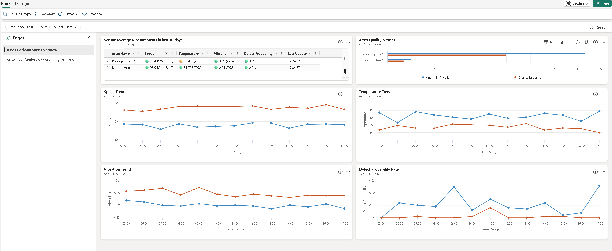
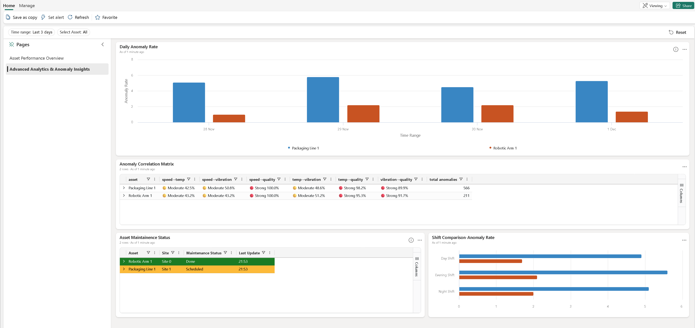

# Real-Time Intelligence Operations Dashboard Guide

## Overview

The Real-Time Intelligence (RTI) Operations Dashboard provides instant visibility into the health and performance of key assets at manufacturing facility located at **Contoso Outdoors – Ho Chi Minh Facility**.
It monitors two critical assets:

- **Robotic Arm 1 (A_1000)**
- **Packaging Line 1 (A_1001)**

The dashboard uses **live sensor data, Z-score–based anomaly detection**, and **trend analysis** to help teams identify issues early, prevent downtime, and improve product quality. For more information about the statistical z-score analysis, please refer to [Data Analysis Guide](../src/kql/data_analysis/data_analysis_guide.md) for the details. 

## Data Requirement 

The dashboard's effectiveness depends on the quality of the underlying dataset. To ensure accurate analysis using the sample data provided by this solution accelerator:

1. **Refresh Historical Data**: Follow the [Fabric Data Ingestion Guide](./FabricDataIngestion.md) to load baseline data. Use the options `--refresh-dates` and `--overwrite` to get a fresh and up to date dataset. 
2. **Start Real-Time Simulation**: Use the [Event Simulator Guide](./EventSimulatorGuide.md) to generate streaming telemetry.

The event simulator streams real-time telemetry data into the Fabric Event House, which serves as the data source for the RTI Operations Dashboard. It supports multiple operational modes: **Normal Mode** and **Enhanced Anomaly Mode**

## RTI Operations Dashboard 
The Real-Time Intelligence Operations Dashboard is a two-page interactive dashboard providing comprehensive asset performance monitoring. Page 1 shows real-time sensor status, quality metrics, and trends; Page 2 provides advanced analytics including anomaly correlations and maintenance insights.

**Business Value:**

- **Real-Time Monitoring:** Instant visibility into equipment health and performance across all critical assets
- **Early Issue Detection:** Statistical anomaly detection identifies problems before they cause downtime
- **Data-Driven Decisions:** Z-score analysis provides objective context for operational decisions
- **Risk Prioritization:** Color-coded alerts help teams focus resources on the most critical issues first

### Page 1: Asset Performance Overview

This page serves as main monitoring view. It shows current equipment health, sensor status, and key performance trends.

#### Real Time Sensor Status with Z-Score Analysis

Displays latest sensor readings with real-time anomaly status. Each row shows Speed, Temperature, Vibration, and Defect Probability values with Z-score-based health indicators.

#### Asset Quality Metrics

Side-by-side comparison of anomaly rates and quality issues between assets in a column chart format. Uses Z-score analysis with a 30-day baseline (excludes last 24 hours).

- Key Metrics Displayed:
  - **Anomaly Rate %:** Combined percentage of speed, temperature, and vibration anomalies
  - **Quality Issues %:** Percentage of events with defect probability exceeding 5%

#### Trend Analysis 
The four Trend charts display time-series trends for each sensor metric **(Speed, Temperature, Vibration)** and predicted Defect Probability based on the combined sensor values. Each trend chart helps identify patterns, gradual drift, or sudden changes in equipment behavior.

---

## Page 2: Advanced Analytics & Anomaly Insights

This page provides deeper insights into operational patterns, correlations, and maintenance status for advanced troubleshooting and strategic planning.

#### Daily Anomaly Rate
Displays the overall anomaly rate percentage over time per day, showing the combined rate of speed, temperature, vibration, and quality anomalies as a percentage of total events.

#### Anomaly Correlation Matrix
This table highlights how often different sensor metrics experience anomalies together. In other words, it answers:

- *When Speed shows an anomaly, how likely is Temperature also abnormal?*
- *Do vibration issues often occur alongside quality problems?*

**Columns Explained:**

- **Asset**: Name of the equipment being monitored.
- **Speed→Temp**: How often speed anomalies coincide with temperature anomalies.
- **Speed→Vibration**: Indicates if speed fluctuations are linked to mechanical stress.
- **Speed→Quality**: Shows whether abnormal speed impacts defect probability.
- **Temp→Vibration**: Correlation between thermal issues and vibration problems.
- **Temp→Quality**: Highlights if overheating affects product quality.
- **Vibration→Quality**: Relationship between mechanical health and manufacturing precision.
- **Total Anomalies**: Combined count of all anomaly events for the asset.

**Example Interpretations:**

- High Speed→Vibration = Speed variations causing mechanical stress
- High Temp→Quality = Overheating directly impacting product quality
- High Vibration→Quality = Mechanical issues affecting manufacturing precision

#### Asset Maintenance Status
Displays a table showing each asset's maintenance status and last update time.

#### Shift Comparison - Anomaly Rate
Compares anomaly rates across three work shifts to identify operational patterns and performance differences. 